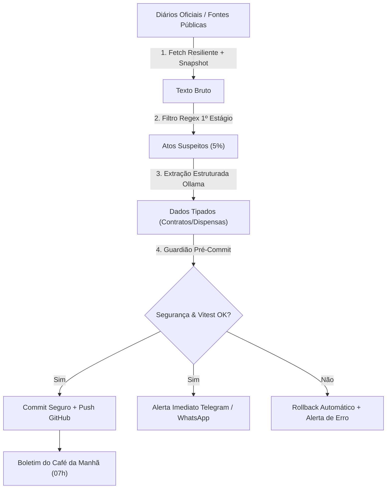

# Plano de Automação Local com LLM (Ollama, PicoClaw, Guardião e Boletim)

> **Tipo:** PLANO
> **Domínio:** 05-operacao
> **Última medição:** 2026-09-03
> **Leitura estimada:** curta (≤ 5 min)
> **Relacionados:** [README dos planos](../README.md), [AGENTS.md](/AGENTS.md)
> **Palavras-chave:** plano automacao local, documentacao

## Sumário

- [Visão Geral e Arquitetura](#visão-geral-e-arquitetura)
- [Módulos da Suíte de Automação](#módulos-da-suíte-de-automação)
- [Ciclos de Execução Agendados](#ciclos-de-execução-agendados)
- [Como Executar Sob Demanda](#como-executar-sob-demanda)
- [Regras de Segurança e Auto-Cura](#regras-de-segurança-e-auto-cura)

---

## Visão Geral e Arquitetura

A suíte de automação local roda na máquina de produção (`home-pc`) para executar tarefas de coleta, mineração de diários oficiais, auditoria de segurança pré-commit e geração de boletins diários sem intervenção manual.



---

## Módulos da Suíte de Automação

1. **`fetch-resiliente.mts`**: Cliente HTTP com 3 tentativas exponenciais e fallback em snapshot local caso o portal governamental fique fora do ar.
2. **`triagem-diarios-ollama.mts`**: Filtro em 2 estágios (Regex ultrarrápido + Ollama local) para minerar contratos e dispensas sem sobrecarregar a GPU.
3. **`guardiao-pre-commit.mts`**: Verificador de auto-cura que roda checagem de CPFs e suíte de testes antes de qualquer commit. Em caso de erro, reverte o staging.
4. **`boletim-matinal.mts`**: Gerador do "Boletim do Café da Manhã" (07:00) com estatísticas de saúde do site, acessos e novos atos minerados.
5. **`orquestrador-rotinas.mts`**: Ponto de entrada central com controle de janelas de execução.

---

## Ciclos de Execução Agendados

- **03:00 (Madrugada):** Coletas resilientes e mineração de diários via Ollama.
- **06:00 (Manhã):** Verificação de integridade e auditoria de segurança (Argus/Hermes).
- **07:00 (Boletim):** Envio do relatório consolidado no Telegram.
- **24h (Contínuo):** Ouvinte do bot @ControlePopularBOT e telemetria anônima.

---

## Como Executar Sob Demanda

No terminal do PowerShell ou WSL:

```bash
# Executa o ciclo completo
npx tsx scripts/automacao/orquestrador-rotinas.mts --todos

# Executa apenas a coleta da madrugada
npx tsx scripts/automacao/orquestrador-rotinas.mts --madrugada

# Executa o boletim matinal
npx tsx scripts/automacao/orquestrador-rotinas.mts --boletim
```

---

## Regras de Segurança e Auto-Cura

- **Zero-Secret & Zero-CPF:** Nenhum commit é realizado sem aprovação do script `scripts/checar-dado-pessoal-em-dado.py`.
- **Safe Rollback:** Qualquer falha técnica restaura o estado limpo do repositório imediatamente para evitar deploy com código quebrado.
