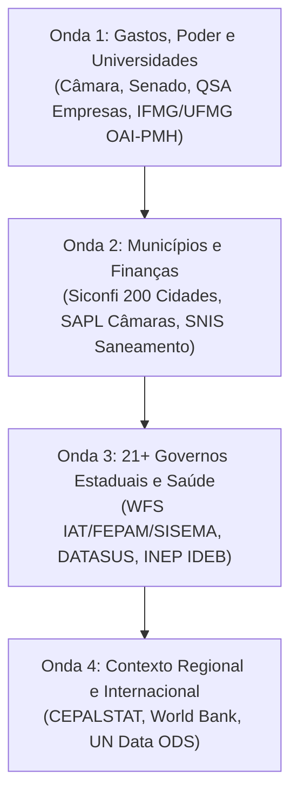

# Mapeamento Amplo de Fontes e APIs — Brasil, América Latina e Organismos Internacionais

> **Tipo:** FONTE
> **Domínio:** global
> **Última medição:** 2026-09-19
> **Leitura estimada:** longa (> 15 min)
> **Relacionados:** [FONTES.md](FONTES.md), [PRODUTO.md](../01-produto/PRODUTO.md), [ESTADO.md](../02-estado/ESTADO.md), [AGENTS.md](/AGENTS.md)
> **Palavras-chave:** apis, fontes, brasil, capitais, municipios, estados, universidades, ifmg, cefet, puc, ufrj, ufmg, usp, dados abertos, cepal, onu, transparencia, câmara, senado, snis, inpe, datasus, qsa

## Sumário

- [1. Propósito](#1-propósito)
- [2. Critérios de Inclusão e Impacto Social](#2-critérios-de-inclusão-e-impacto-social)
- [3. Arquitetura de Ingestão e Restrições Técnicas](#3-arquitetura-de-ingestão-e-restrições-técnicas)
- [4. Catálogo de APIs: Brasil Federal e Poderes](#4-catálogo-de-apis-brasil-federal-e-poderes)
- [5. Catálogo de APIs: Meio Ambiente, Território e Clima](#5-catálogo-de-apis-meio-ambiente-território-e-clima)
- [6. Catálogo de APIs: Social, Saúde e Educação](#6-catálogo-de-apis-social-saúde-e-educação)
- [7. Catálogo de APIs: Capitais e 200 Cidades Estratégicas](#7-catálogo-de-apis-capitais-e-200-cidades-estratégicas)
- [8. Catálogo de APIs: Governos Estaduais (21+ Estados)](#8-catálogo-de-apis-governos-estaduais-21-estados)
- [9. Catálogo de APIs: Universidades e Institutos Federais/Estaduais](#9-catálogo-de-apis-universidades-e-institutos-federaisestaduais)
- [10. Catálogo de APIs: América Latina e Organismos Internacionais (ONU/CEPAL)](#10-catálogo-de-apis-américa-latina-e-organismos-internacionais-onucepal)
- [11. Catálogo Amplo Multissetorial por Áreas Temáticas](#11-catálogo-amplo-multissetorial-por-áreas-temáticas)
- [12. Plano de Execução por Ondas](#12-plano-de-execução-por-ondas)
- [13. Matriz de Automação Periódica Contínua de APIs](#13-matriz-de-automação-periódica-contínua-de-apis)
- [14. Mapeamento de Executivos Estaduais e Assembleias Legislativas (ALEs)](#14-mapeamento-de-executivos-estaduais-e-assembleias-legislativas-ales)
- [15. Fornecedores Globais Multinacionais (EUA, Europa e China) nos Órgãos Públicos](#15-fornecedores-globais-multinacionais-eua-europa-e-china-nos-órgãos-públicos)
- [16. Acordos, Parcerias e Licitações Internacionais em 7 Setores (Brasil, EUA, Europa e China)](#16-acordos-parcerias-e-licitações-internacionais-em-7-setores-brasil-eua-europa-e-china)
- [17. Blog Cívico: 10 Reportagens Estratégicas e Síntese de Voz (TTS)](#17-blog-cívico-10-reportagens-estratégicas-e-síntese-de-voz-tts)

## 1. Propósito

Este catálogo mapeia **fontes de dados e APIs públicas ainda não exploradas ou em fase de expansão** para o portal [controlepopular.com.br](https://www.controlepopular.com.br).

O foco absoluto é o **interesse social**: democratizar dados de remuneração pública, controle de gastos de mandatos, saúde básica, saneamento, alertas de desmatamento/risco climático, finanças municipais das 27 capitais e 200 cidades-polo, integridade dos 21+ estados, produção acadêmica e orçamentos das Universidades públicas e privadas, e indicadores comparados da América Latina e ONU.

## 2. Critérios de Inclusão e Impacto Social

Toda fonte nova deve atender a pelo menos um dos quatro pilares de controle popular (ver [AGENTS.md](/AGENTS.md)):

1. **Social:** Direitos básicos, combate à pobreza extrema, acesso à saúde e educação.
2. **Ambiental:** Recursos hídricos, saneamento básico, desmatamento, licenças e barragens.
3. **Econômico & Poder:** Gastos de mandatos (gabinete/cota), remuneração de agentes públicos, concentração de contratos e composição de sócios (QSA) de empresas.
4. **Educação & Contexto:** Produção científica aplicada a desastres/clima, transparência universitária, tendências históricas e microresumos sem jargão.

## 3. Arquitetura de Ingestão e Restrições Técnicas

| Regra | Aplicação Prática |
|---|---|
| **Storage do Banco** | Neon em 94%. **Nenhum dump bruto entra no PostgreSQL agora.** Fontes novas entram como JSON compactado (`apps/web/data/`), `.geojson.gz` estático em `public/` ou consulta direta ao vivo via API no cliente. |
| **Proteção a Dados Pessoais** | Varrer CPF por mod-11 antes de qualquer commit (`scripts/checar-dado-pessoal-em-dado.py`). Remuneração de servidores é pública (LAI art. 31), mas sem CPF/RG. |
| **Respeito aos Servidores** | Pausa de 1–2 s entre chamadas, User-Agent explícito do projeto, respeito a `robots.txt`. |
| **5 Elementos em Páginas Densas** | Toda tela com grande volume deve conter: Gráfico SVG/CSS, Cartões de Topo, Download CSV (com `;` e BOM UTF-8), Filtro funcional e Ordenação por coluna. |

---

## 4. Catálogo de APIs: Brasil Federal e Poderes

### 4.1. Câmara dos Deputados (API v2)
- **URL Base:** `https://dadosabertos.camara.leg.br/api/v2`
- **Autenticação:** Aberta, sem chave.
- **Endpoints Chave:**
  - `GET /deputados/{id}/despesas`: Cota para o Exercício da Atividade Parlamentar (CEAP) mês a mês, por fornecedor e CNPJ.
  - `GET /proposicoes`: Votações, tramitações e autoria de projetos de lei.
- **Armadilhas Medidas:** Paginação requer parâmetro `itens=100` e cursor de página. Valores de reembolso podem sofrer glosa posterior.
- **Uso no Site:** Página do Congresso — gastos mensais do gabinete de cada deputado com link à nota fiscal.

### 4.2. Senado Federal (Dados Abertos)
- **URL Base:** `https://legis.senado.leg.br/dadosabertos`
- **Autenticação:** Aberta, XML/JSON.
- **Endpoints Chave:**
  - `GET /senador/{id}/despesas`: Verba indenizatória do senador por tipo de despesa e mês.
  - `GET /materia/pesquisa/lista`: Matérias legislativas em tramitação.
- **Armadilhas Medidas:** Responde XML por padrão se não enviado cabeçalho `Accept: application/json`.

### 4.3. Portal da Transparência do Governo Federal (Controladoria-Geral da União)
- **URL Base:** `https://api.portaldatransparencia.gov.br/api-de-dados`
- **Autenticação:** Chave de API gratuita cadastrada na CGU (`chave-api-dados`).
- **Endpoints Chave:**
  - `/servidores`: Remuneração mensal discriminada (salário base, penduricalhos, deduções e líquido).
  - `/contratos`: Contratos firmados pela administração pública federal com empresas.
  - `/emendas-parlamentares`: Emendas orçamentárias pagas por município de destino.
- **Armadilhas Medidas:** Rate limit estrito de 90 req/min. Necessário cache local ou consultas agregadas.

### 4.4. Receita Federal — Cadastro de CNPJs e QSA (Brasil.io / Dados Abertos)
- **URL Base:** `https://brasil.io/api/dataset/socios-brasil/` e dumps mensais da Receita Federal.
- **Autenticação:** API key ou download de tabelas públicas estáticas.
- **O que dá:** Quadro de Sócios e Administradores (QSA), capital social, CNAE e controle societário.
- **Uso no Site:** Enriquecimento das páginas de `/empresas` para exibir os donos, administradores e conselheiros das concessionárias e mineradoras que atuam nos municípios.

---

## 5. Catálogo de APIs: Meio Ambiente, Território e Clima

### 5.1. INPE — DETER e PRODES (TerraBrasilis API)
- **URL Base:** `https://terrabrasilis.dpi.inpe.br/geoserver/` e APIs GeoJSON.
- **Autenticação:** Aberta (WFS / GeoJSON / REST).
- **O que dá:** Polígonos e estatísticas de alertas diários de desmatamento (DETER) e taxas consolidadas anuais (PRODES) por município e bioma (Cerrado, Mata Atlântica e Amazônia).
- **Uso no Site:** Alertas de desmatamento por município em abas ambientais, comparando a série histórica de perda de cobertura florestal.

### 5.2. SNIS — Sistema Nacional de Informações sobre Saneamento
- **URL Base:** `https://www.snis.gov.br/` (e API do Novo Marco do Saneamento / SINISA).
- **Autenticação:** Dados abertos via REST / CSV estruturado.
- **O que dá:** Porcentagem da população com acesso a água tratada, esgoto coletado e esgoto tratado por município.
- **Impacto Social Crítico:** Permite expor se o município cumpre as metas do Marco Legal do Saneamento (99% de água e 90% de esgoto até 2033).

### 5.3. ANA — Agência Nacional de Águas e Saneamento Básico (HidroWeb / SNIRH)
- **URL Base:** `https://telemetriaws1.ana.gov.br/ServiceData.asmx` e painéis de dados abertos.
- **Autenticação:** Aberta.
- **O que dá:** Monitoramento fluviométrico e pluviométrico de rios e bacias hidrográficas em tempo real, além do cadastro de outorgas federais de captação de água.

---

## 6. Catálogo de APIs: Social, Saúde e Educação

### 6.1. DATASUS — CNES e TABNET (OpenData SUS)
- **URL Base:** `https://opendatasus.saude.gov.br/api/3/action/` e microdados TABNET.
- **Autenticação:** Aberta (CKAN API).
- **O que dá:** Quantidade de leitos hospitalares públicos (SUS) vs. privados por município, cobertura de equipes de Saúde da Família e dados de morbidade/mortalidade.
- **Armadilhas Medidas:** Formato padrão costuma ser DBC/DBF. Ingestão necessita de script de conversão para parquet/JSON plano.

### 6.2. INEP — Censo Escolar e IDEB
- **URL Base:** `https://www.gov.br/inep/pt-br/acesso-a-informacao/dados-abertos`
- **Autenticação:** Aberta (REST e arquivos estáticos compactados).
- **O que dá:** Infraestrutura escolar básica por município (escolas sem saneamento, sem água potável, sem energia elétrica ou internet) e nota do IDEB.
- **Impacto Social:** Cruza infraestrutura escolar real com o orçamento municipal repassado.

### 6.3. CadÚnico / SAGICAD (Ministério do Desenvolvimento Social)
- **URL Base:** `https://aplicacoes.mds.gov.br/sagi/portal/`
- **Autenticação:** Aberta via exportações tabulares periódicas.
- **O que dá:** Número de famílias cadastradas no Cadastro Único em situação de extrema pobreza, pobreza e baixa renda por município.

---

## 7. Catálogo de APIs: Capitais e 200 Cidades Estratégicas

Cobrir as 27 Capitais e os 172+ polos do interior mapeados em `apps/web/data/polos-interior-ibge.json`.

### 7.1. Câmaras Municipais — Interlegis / SAPL (Senado Federal)
- **URL Base:** `https://sapl.[cidade].[uf].leg.br/api/` (ou portais federados Interlegis).
- **Cobertura:** Mais de 1.800 câmaras municipais do Brasil, incluindo diversas capitais e polos do interior.
- **O que dá:** Lista de vereadores, presença em sessões, projetos de lei, matérias em votação e diários legislativos.
- **Vantagem Técnica:** API REST padronizada pelo Senado Federal em formato JSON aberto, com custo de ingestão reduzido.

### 7.2. Portais CKAN e Dados Abertos das Capitais
- **São Paulo (SP):** `http://dados.prefeitura.sp.gov.br/api/3/action/` — compras, orçamento, servidores e saúde.
- **Belo Horizonte (MG):** `https://dados.pbh.gov.br/api/3/action/` — despesas empenhadas, contratos e transportes.
- **Rio de Janeiro (RJ):** `https://dados.prefeitura.rio/api/3/action/` — contratos, infraestrutura e educação.
- **Curitiba (PR):** `https://dadosabertos.c3sl.ufpr.br/` e portal da transparência.
- **Recife (PE):** `http://dados.recife.pe.gov.br/api/3/action/` — mobilidade, saneamento e finanças.
- **Salvador (BA):** `https://dados.salvador.ba.gov.br/` — receitas e execução orçamentária.
- **Fortaleza (CE):** `https://dados.fortaleza.ce.gov.br/` — catálogo aberto municipal.
- **Porto Alegre (RS):** `https://dadosabertos.poa.br/` — transparência pública municipal.

### 7.3. Siconfi — Secretaria do Tesouro Nacional (DCA, RREO e RGF Municipal)
- **URL Base:** `https://apidatalake.tesouro.gov.br/ords/siconfi/tt/`
- **Cobertura:** 100% dos 5.570 municípios brasileiros (DCA anual e RREO bimestral).
- **O que dá:** Receitas tributárias próprias vs. dependência do FPM, gastos mínimos constitucionais em Saúde (15%) e Educação (25%), e despesa total com pessoal contra o teto da LRF (54%).
- **Uso no Site:** Comparativo das 200 cidades estratégicas para expor dependência de transferências e equilíbrio fiscal.

---

## 8. Catálogo de APIs: Governos Estaduais (21+ Estados)

Integração com os portais de transparência, dados abertos e licenciamento dos 21+ estados mapeados em `docs/relatorio-mapeamento-27-estados.md`.

### 8.1. Minas Gerais (MG)
- **Portal de Dados Abertos:** `https://dados.mg.gov.br/api/3/action/` (CKAN estadual).
- **Transparência e Remuneração:** `https://transparencia.mg.gov.br/`.
- **Meio Ambiente:** SISEMA / IGAM / FEAM (outorgas e licenciamento via WFS).

### 8.2. São Paulo (SP)
- **Portal de Dados Abertos:** `https://dadosabertos.sp.gov.br/api/3/action/`.
- **Transparência e Servidores:** `https://www.transparencia.sp.gov.br/`.
- **Meio Ambiente:** e-CETESB e SpÁguas (outorgas e infrações).

### 8.3. Rio de Janeiro (RJ)
- **Portal de Dados Abertos:** `http://catalogo.rj.gov.br/`.
- **Transparência:** `http://transparencia.rj.gov.br/`.
- **Meio Ambiente:** INEA / SELCA (REST API).

### 8.4. Paraná (PR)
- **Portal de Dados:** `https://dados.pr.gov.br/`.
- **Meio Ambiente e Outorgas:** IAT-PR (`geoservicos.iat.pr.gov.br`, WFS de outorgas hídricas).

### 8.5. Rio Grande do Sul (RS)
- **Portal de Dados Abertos:** `https://dados.rs.gov.br/api/3/action/`.
- **Meio Ambiente:** FEPAM-RS (Shapefile/CSV de autos de infração e embargos ambientais).

### 8.6. Bahia (BA)
- **Portal de Transparência:** `https://transparencia.ba.gov.br/`.
- **Meio Ambiente:** INEMA-BA (SEIA e DOE-BA).

### 8.7. Mato Grosso (MT) e Mato Grosso do Sul (MS)
- **SEMA-MT:** `https://geoportal.sema.mt.gov.br` (CSV/WFS de desmatamento, licenças e autos).
- **IMASUL-MS:** PIN e SIRIEMA (repositório GIS).

### 8.8. Goiás (GO)
- **SEMAD-GO:** SIGA GeoNode (`siga.meioambiente.go.gov.br/catalogue`, camadas abertas WFS).

### 8.9. Ceará, Maranhão e Piauí
- **SEMACE (CE):** Natuur Online (processos e autos).
- **SEMA-MA:** SIGLA / Guará (licenciamento e infrações).
- **SEMARH-PI:** SIGA-PI (tabelas abertas de outorgas e licenças).

---

## 9. Catálogo de APIs: Universidades e Institutos Federais/Estaduais

As instituições de ensino e pesquisa concentram acervos científicos, estudos sobre desastres socioambientais, monitoramentos independentes de bacias hidrográficas e grandes orçamentos públicos.

### 9.1. Institutos Federais e Centros de Tecnologia (IFs / CEFETs)
- **IFMG (Instituto Federal de Minas Gerais):**
  - Portal de Dados Abertos: `https://dados.ifmg.edu.br/api/3/action/` (CKAN).
  - O que dá: Orçamento executado, contratos de infraestrutura, bolsas de pesquisa e projetos de extensão comunitária (ex: vigilância de bacias atingidas).
- **CEFET-MG (Centro Federal de Educação Tecnológica de Minas Gerais):**
  - Portal da Transparência e Catálogo Institucional.
  - O que dá: Pesquisas em engenharia sanitária e mineração sustentável, contratos e orçamento.
- **Rede Federal EPCT (MEC / Plataforma Nilo Peçanha):**
  - URL: `https://plataformanilopecanha.mec.gov.br/` (Microdados abertos de todos os IFs do Brasil).
  - O que dá: Evasão escolar, custo por aluno, infraestrutura de laboratórios e corpo docente.

### 9.2. Universidades Federais (UFMG, UFRJ, UnB, UFBA, UFRGS)
- **UFMG (Universidade Federal de Minas Gerais):**
  - Plataforma Brumadinho UFMG: Pesquisas científicas independentes sobre o rompimento da barragem da Vale, impactos na saúde e contaminação por metais pesados no Rio Paraopeba.
  - Repositório Institucional da UFMG (`https://repositorio.ufmg.br/` via OAI-PMH REST).
  - Transparência UFMG: Execução orçamentária e bolsas de assistência estudantil.
- **UFRJ (Universidade Federal do Rio de Janeiro):**
  - Repositório Pantheon e API de Dados Abertos: Pesquisas do COPPE em risco geológico, barragens e recursos hídricos.
- **UnB, UFBA e UFRGS:**
  - Repositórios científicos abertos via protocolo OAI-PMH (`/oai/request?verb=Identify`), permitindo ingestão automática de teses e artigos sobre conflitos socioambientais, direitos humanos e gestão pública.

### 9.3. Universidades Estaduais (USP, UNICAMP, UNESP, UEMG, UERJ)
- **USP (Universidade de São Paulo):**
  - Portal da Transparência USP: Remuneração detalhada dos docentes e servidores, contratos e convênios.
  - Repositório Aberto da Produção Intelectual: Centros de estudos de bacias hidrográficas e clima.
- **UNICAMP e UNESP:**
  - Portais de dados abertos e transparência orçamentária paulista.
- **UEMG (Universidade do Estado de Minas Gerais):**
  - Estudos regionais sobre o interior de Minas Gerais e impactos socioeconômicos da mineração.

### 9.4. Universidades Privadas e Comunitárias (PUC Minas, PUC-Rio, etc.)
- **JUMA / PUC-Rio:**
  - Jurisprudência de Mudanças Climáticas (187 casos mapeados no HTML, já catalogado em `FONTES.md`).
- **PUC Minas:**
  - Grupo de Estudos em Direito Ambiental e Mineração; clínicas de direitos humanos com assessoria jurídica a atingidos por barragens.
- **MEC / e-MEC & Prouni:**
  - Dados abertos de bolsas Prouni e FIES por universidade privada (`dados.gov.br`), mensurando o retorno social de renúncias fiscais concedidas às mantenedoras privadas.

---

## 10. Catálogo de APIs: América Latina e Organismos Internacionais (ONU/CEPAL)

### 10.1. CEPALSTAT (Comisión Económica para América Latina y el Caribe)
- **URL Base:** `https://api-cepalstat.cepal.org/cepalstat/api/v1`
- **Autenticação:** Aberta, REST / JSON.
- **O que dá:** Indicadores socioeconômicos e ambientais comparados de toda a América Latina:
  - Distribuição de renda (Coeficiente de Gini);
  - Gastos sociais do governo central (% do PIB);
  - Vulnerabilidade climática e desastres naturais por país.
- **Uso no Site:** Painéis de contexto regional que mostram onde o Brasil e seus estados se posicionam em relação aos vizinhos latino-americanos.

### 10.2. Banco Mundial (World Bank Open Data API)
- **URL Base:** `https://api.worldbank.org/v2`
- **Autenticação:** Aberta, sem chave obrigatória (`format=json`).
- **Endpoints Chave:**
  - `GET /country/{country}/indicator/{indicator}`: Séries temporais de emissão de CO2, acesso a eletricidade rural, investimentos em infraestrutura e inflação.
- **Vantagem Técnica:** Resposta veloz em JSON, documentação rigorosa e disponibilidade histórica de 50+ anos.

### 10.3. UN Data (Nações Unidas / ODS - Objetivos de Desenvolvimento Sustentável)
- **URL Base:** `https://unstats.un.org/SDGAPI/v1/rest/`
- **Autenticação:** Aberta.
- **O que dá:** Monitoramento oficial de cada um dos 17 Objetivos de Desenvolvimento Sustentável (ODS) da ONU para o Brasil e países da região.

---

## 11. Catálogo Amplo Multissetorial por Áreas Temáticas

Para além das frentes originais do portal, mapeiam-se APIs abertas de alto potencial cívico e analítico:

### 11.1. Infraestrutura, Transportes e Mobilidade
- **ANTT (Agência Nacional de Transportes Terrestres) — Dados Abertos**:
  - `https://dados.antt.gov.br/api/3/action/`: Concessões de rodovias federais, pedágios, linhas regulares de ônibus interestaduais e transporte de cargas.
- **ANAC (Agência Nacional de Aviação Civil)**:
  - `https://sistemas.anac.gov.br/dadosabertos/`: Tarifas aéreas domésticas e internacionais comercializadas, pontualidade de voos e frota de aeronaves.
- **DNIT (Departamento Nacional de Infraestrutura de Transportes)**:
  - APIs de condições da malha rodoviária federal, pontos críticos de acidentes e obras públicas de pavimentação.

### 11.2. Energia, Petróleo e Mineração Não-Metálica
- **ANEEL (Agência Nacional de Energia Elétrica)**:
  - `https://dadosabertos.aneel.gov.br/api/3/action/`: Tarifas de energia elétrica residencial/industrial por distribuidora, interrupções de fornecimento (DEC/FEC) e geração solar distribuída.
- **ANP (Agência Nacional do Petróleo, Gás Natural e Biocombustíveis)**:
  - `https://dados.gov.br/dados/conjuntos-dados/serie-historica-de-precos-de-combustiveis-por-revenda`: Série semanal de preços de gasolina, etanol, diesel e GLP por posto revendedor em todos os municípios pesquisados.
- **ONS (Operador Nacional do Sistema Elétrico)**:
  - `https://dados.ons.org.br/`: Carga de energia em tempo real, geração por matriz (hidro, eólica, solar, fóssil) e nível dos reservatórios hidrelétricos.

### 11.3. Finanças Públicas, Crédito e Mercados
- **Banco Central do Brasil — SGS (Sistema Gerenciador de Séries Temporais)**:
  - `https://api.bcb.gov.br/dados/serie/bcdata.sgs.{codigo}/dados?formato=json`: Séries históricas de taxas de juros (Selic), inflação (IPCA, INPC, IGP-M), crédito bancário por estado/município e câmbio diário oficial.
- **CVM (Comissão de Valores Mobiliários) — Dados Abertos**:
  - `https://dados.cvm.gov.br/dados/`: Demonstrativos Financeiros Padronizados (DFP/ITR), fatos relevantes e fundos de investimento regulados.
- **SUSEP (Superintendência de Seguros Privados)**:
  - Dados de sinistros e apólices de seguro rural, seguro garantia de obras públicas e seguros de vida/previdência.

### 11.4. Ciência, Tecnologia, Patentes e Inovação
- **INPI (Instituto Nacional da Propriedade Industrial)**:
  - `https://dados.gov.br/dados/conjuntos-dados/inpi-patentes`: Registro de patentes de invenção, modelos de utilidade e marcas registradas por empresas no Brasil.
- **CNPq — Plataforma Lattes / Extrator Aberto**:
  - Produção científica, grupos de pesquisa cadastrados e bolsas de fomento à iniciação científica e pós-graduação.
- **CAPES — Sucupira e Catálogo de Teses**:
  - Avaliação de programas de pós-graduação stricto sensu de todas as universidades e institutos de pesquisa.

### 11.5. Cultura, Patrimônio e Comunicações
- **IPHAN (Instituto do Patrimônio Histórico e Artístico Nacional)**:
  - Cadastro Nacional de Bens Tombados, sítios arqueológicos identificados e patrimônio imaterial registrado.
- **Anatel — Sistema Mosaico**:
  - `https://sistemas.anatel.gov.br/dadosabertos/`: Cobertura de antenas 4G/5G por operadora e por bairro/setor censitário, além de conexões de banda larga fixa por velocidade.
- **Fundo Nacional de Cultura / MinC (além do Salic/Rouanet)**:
  - Execução da Lei Paulo Gustavo e Política Nacional Aldir Blanc (PNAB) descentralizada por município.

---

## 12. Plano de Execução por Ondas

1. **Onda 1 (Imediata — Sem custo de banco):**
   - Coletar metadados de gastos de deputados/senadores com scripts leves em `scripts/etl/congresso/`.
   - Adicionar o QSA de grandes empresas mapeadas em `apps/web/data/empresas-qsa.json`.
   - Ingestão de publicações científicas de desastres e clima da UFMG/PUC via OAI-PMH.
2. **Onda 2 (Municípios & Saneamento):**
   - Ingestão das matrizes fiscais do Siconfi (LRF / Saúde / Educação) para as 27 capitais e 172 polos.
   - Compactar os dados municipais do SNIS (Água e Esgoto) no mesmo padrão do ComunicaBR (`lib/estatico/compactar.ts`).
3. **Onda 3 (Estados & Saúde):**
   - Integração das camadas de outorga e autos de infração dos 21 estados (IAT-PR, FEPAM-RS, SEMA-MT, etc.).
   - Ranking hospitalar DATASUS por CID-10 nos polos estratégicos.
4. **Onda 4 (LatAm & ONU):**
   - Séries históricas da CEPAL e Banco Mundial em páginas analíticas do Observatório Nacional Socioambiental (ONSA).

---

## 13. Matriz de Automação Periódica Contínua de APIs

Para manter o portal com informações públicas sempre atualizadas sem depender de intervenção manual e sem sobrecarregar o armazenamento do banco gerenciado Neon (~94% de ocupação):

| Fonte / API Pública | Periodicidade | Pipeline / Script | Formato de Armazenamento | Destino no Portal |
|---|---|---|---|---|
| **PNCP (Compras Públicas Lei 14.133)** | Diária (03:00) | `scripts/coletar-pncp-diario.py` | JSON estático em `apps/web/data/contratos-pncp-consolidado.json` | `/governo/[uf]/editais`, `/radar-editais` |
| **Banco Central (SGS Macroeconomia)** | Diária (19:00) | `scripts/coletar-series-economicas-bcb.py` | JSON estático em `apps/web/data/series-economicas-bcb.json` | `/estado-e-economia/indicadores` e Top 100 |
| **ANP (Combustíveis por Posto)** | Semanal (Segundas) | Ingestão em lote dos microdados da ANP | Dataset JSON compactado | `/estado-e-economia/combustiveis` |
| **INPE / DETER (Alertas)** | Semanal (Terças) | ETL TerraBrasilis com redução de vértices | `.geojson.gz` estático em `public/terras/globo/dados/` | Painel 3D Globo (`/funcaosocialterra/mapa`) |
| **Câmara & Senado (CEAP / Cota)** | Mensal (dia 05) | Script REST puxando despesas do mês anterior | JSON compactado em `apps/web/data/congresso-ceap-*.json` | `/congresso/parlamentares` |
| **ANEEL (DEC/FEC Apagões)** | Mensal (dia 10) | Microdados de continuidade por distribuidora | Ingestão nos dados municipais compactos | `/[municipio]/energia` |
| **Siconfi (RREO / RGF)** | Bimestral / Quadrimestral | API Siconfi / Tesouro Nacional | Matriz fiscal nos perfis das cidades | `/[municipio]/prefeitura` e `/governo/[uf]` |

---

## 14. Mapeamento de Executivos Estaduais e Assembleias Legislativas (ALEs)

O portal acompanha os dois poderes em nível estadual nos 26 estados e no Distrito Federal:
- **Poder Executivo (`/governo/[uf]`):**
  - **Planos de Governo e Promessas:** Monitoramento das propostas registradas no TSE cruzadas com o Diário Oficial e SISOP;
  - **Medidas Anunciadas & Decretos:** Acompanhamento de decretos de emergência, contingenciamentos e programas de governo;
  - **Contratos e Editais Estaduais:** Ingestão de compras públicas pelo PNCP e diários oficiais.
- **Poder Legislativo (`/governo/[uf]/legislativo`):**
  - **Ranking Garantista de Deputados Estaduais:** Baseado em `apps/web/lib/atuacao-parlamentar.ts`, pontuando ampliação de direitos e aplicando desconto proporcional sobre faltas em plenário;
  - **Salários e Remunerações:** Subsídio constitucional bruto (teto legal de até 75% do deputado federal = R$ 34.774,64);
  - **Equipe de Gabinete:** Quantidade de servidores comissionados e custo total da folha mensal;
  - **Cota Parlamentar:** Gastos indenizatórios de gabinete (combustível, locação de veículos e imóveis, consultoria e divulgação).

---

## 15. Fornecedores Globais Multinacionais (EUA, Europa e China) nos Órgãos Públicos

Mapeamento analítico e financeiro dos conglomerados internacionais que mais faturam no Estado brasileiro:
- **Tecnologia & Nuvem:** Microsoft, Oracle, IBM, SAP, Cisco, AWS, Huawei (redes 5G e backbone RNP);
- **Energia & Transmissão:** State Grid Corporation of China (concessionária de mais de 16.000 km de linhas UHVDC e CPFL Energia);
- **Defesa & Segurança:** Saab AB (F-39 Gripen), Airbus/Helibras (Helicópteros Caracal/Esquilo), Leonardo S.p.A. (Sistemas SISFRON);
- **Engenharia, Portos & Auditoria:** AECOM (Auditora independente das barragens de Brumadinho e Mariana no acordo judicial), CCCC (Ponte Salvador-Itaparica e dragagem portuária em Santos e Paranaguá), Alstom (Metrôs e trens), CRRC (Trens CPTM e SuperVia), Siemens (Equipamentos hospitalares e energia);
- **Mobilidade Elétrica & Maquinário:** BYD (Ônibus elétricos em SP, Curitiba, Campinas e polo fabril de Camaçari/BA), Caterpillar (Máquinas pesadas Codevasf/DNIT);
- **Saúde & Vacinas:** Pfizer, Novartis, Roche, Sanofi (Imunobiológicos e medicamentos do SUS).

**Metodologia de Cruzamento:**
- Valores contratuais em R$ e US$ extraídos do PNCP, SIAFI e Portais de Transparência;
- Lucros globais anuais e acumulados nos últimos 5 e 10 anos extraídos dos relatórios auditados da SEC (Form 10-K / 20-F), IFRS das bolsas europeias e demonstrações oficiais das bolsas de Xangai (SSE) e Hong Kong (HKEX);
- Avaliação da presença ou ausência de acordos formais de compensação tecnológica (*offsets*), geração de empregos no Brasil e nível de dependência técnica (*lock-in*).
- Rota no portal: `/estado-e-economia/fornecedores-multinacionais` (com o padrão de 5 coisas e exportação completa).

---

## 16. Acordos, Parcerias e Licitações Internacionais em 7 Setores (Brasil, EUA, Europa e China)

Observatório contínuo de memorandos de entendimento (MoUs), acordos bilaterais em negociação, leilões e licitações abertas disputadas por consórcios do Brasil, Estados Unidos, 10 principais economias da Europa (Alemanha, França, Reino Unido, Itália, Suécia, Espanha, Holanda, Suíça, Noruega e Bélgica) e China:

| Setor Estratégico | Projetos / Instrumentos Mapeados | Países e Entidades | Status Oficial |
|---|---|---|---|
| **Mineração & Minerais Críticos** | Cooperação Bilateral em Terras Raras (Goiás) e Lítio (Vale do Jequitinhonha); Refinaria de Níquel e Cobalto de São Miguel Paulista (SP) | Brasil, EUA (DFC/EXIMBank), Alemanha (CBA/Jetti), Suécia (Epiroc/Sandvik) | Em Negociação / Implementação sob a Lei 14.994/2026 |
| **Energia & Transição Verde** | Mega-Leilão de Transmissão ANEEL HVDC ±800 kV (Bipolo Nordeste-Centro); Corredor de Hidrogênio Verde Pecém–Roterdã; Terminal Suape–Antuérpia; FPSO Bacalhau | Brasil, China (State Grid), Holanda (Porto de Roterdã), Bélgica (Porto de Antuérpia-Bruges), Noruega (Equinor), França (Total/Engie) | Acordos Firmados / Em Implantação |
| **Infraestrutura & Transporte** | Polo Automotivo Verde e Baterias BYD (Camaçari/BA); Leilões de Rodovias (Rota Mogiana SP/MG, Lote Litoral SP); Malha Oeste e Ferrogrão | Brasil (Governo da Bahia, ANTT, BNDES), China (BYD, CRRC), Itália (ASTM/EcoRodovias), Espanha (Abertis), França (Alstom) | Editais Abertos / Disputa Ativa na B3 |
| **Tecnologia & Sensoriamento** | Satélite Sino-Brasileiro CBERS-6 com Radar Orbital SAR (Monitoramento Amazônia); Nuvem Soberana e Datacenters IA; Cabo Submarino EllaLink | Brasil (INPE/MCTI/MGI), China (CNSA), EUA (Microsoft/Oracle), Europa (Global Gateway) | Acordos Firmados / Investimentos Anunciados |
| **Saúde & Biotecnologia** | Parcerias para o Desenvolvimento Produtivo (PDPs) do CEIS para vacinas e medicamentos oncológicos | Brasil (Ministério da Saúde, Fiocruz, Butantan), Reino Unido (AstraZeneca/GSK), Suíça (Roche/Novartis), França (Sanofi) | Editais Abertos / Chamamentos Públicos |
| **Educação & Ciência** | Programas Bilaterais de Pós-Graduação e Pesquisa em Clima e Transição Energética | Brasil (CAPES/CNPq), Alemanha (DAAD), Reino Unido (British Council/UKRI), EUA (Fulbright) | Acordos Firmados / Editais Anuais |
| **Construção Civil & Mobilidade** | Ponte Salvador-Itaparica (12,4 km); PPP da Linha 6-Laranja do Metrô de SP; Obras de Drenagem e Prevenção do Novo PAC | Brasil (Governo da Bahia, Governo de SP), China (CCCC), Espanha (Grupo Acciona), EUA (Caterpillar) | Obras em Andamento / Contratos Vigentes |

- **Rota Especializada:** [`/estado-e-economia/acordos-e-licitacoes-internacionais`](/estado-e-economia/acordos-e-licitacoes-internacionais).
- **Rigor Cívico:** Pronunciamentos oficiais verbatim de ministros e executivos, fontes institucionais e salvaguardas de contrapartidas sociais/ambientais.

---

## 17. Blog Cívico: 10 Reportagens Estratégicas e Síntese de Voz (TTS)

Para aproximar os dados públicos complexos do cidadão comum e pesquisadores, o portal publica reportagens analíticas e de divulgação científica no blog (`apps/web/data/noticias-portal.json` renderizado em `/noticias/[slug]`):

1. **Fornecedores Multinacionais em TI e Infraestrutura**: Dependência tecnológica dos três poderes frente a softwares proprietários e maquinário estrangeiro;
2. **Acordos Internacionais nos 7 Setores Estratégicos**: Cooperação bilateral em minerais críticos, hidrogênio verde, satélites e ferrovias;
3. **Investimentos Chineses em Energia e Mobilidade**: Expansão da State Grid em concessões de transmissão e polo industrial da BYD na Bahia;
4. **Preço dos Combustíveis nas Capitais e Polos Econômicos**: Levantamento semanal da ANP evidenciando discrepâncias tarifárias e logísticas de gasolina e diesel;
5. **Cobertura de Telefonia Celular e 5G**: Painéis da Anatel mostrando desigualdades regionais e falta de sinal em rodovias federais;
6. **Transparência nas Assembleias Legislativas (ALMG e ALESP)**: Monitoramento sistemático de salários, cotas parlamentares, assiduidade e produção legislativa;
7. **Automação Diária do PNCP com Proteção de Dados (LGPD)**: Rotina contínua de coleta de compras públicas com anonimização por mod-11 de CPFs;
8. **Séries Econômicas do Banco Central e Finanças dos Estados**: Impacto de juros Selic e inflação sobre a capacidade de investimento de estados e municípios;
9. **Minerais Críticos e Soberania no Vale do Jequitinhonha**: Proibição de barragens a montante e exigência de refino local de lítio e terras raras;
10. **Leilões Ferroviários e Modernização de Cargas**: Concessão da Malha Oeste e disputa por fornecimento de locomotivas e trilhos.

### 17.1. Critérios Editoriais Rigorosos
- **Orações diretas:** Sujeito, verbo e predicado para máxima clareza;
- **Frases de até 15 palavras:** Fracionamento de raciocínios para facilitar leitura em telas e por leitores de tela;
- **Fontes oficiais no próprio texto:** Todo número traz o órgão emissor (ANP, Anatel, ANEEL, PNCP, SEC, BNDES, etc.);
- **Resumo no início:** Síntese executiva antes dos detalhes;
- **Acessibilidade com Leitura por Áudio (TTS):** Componente `LeitorAudioArtigoClient.tsx` integrado à página individual da notícia (`/noticias/[slug]`), permitindo ouvir o resumo ou o artigo completo com controle de velocidade (1x, 1.25x, 1.5x) e voz sintetizada em português (`pt-BR`).

