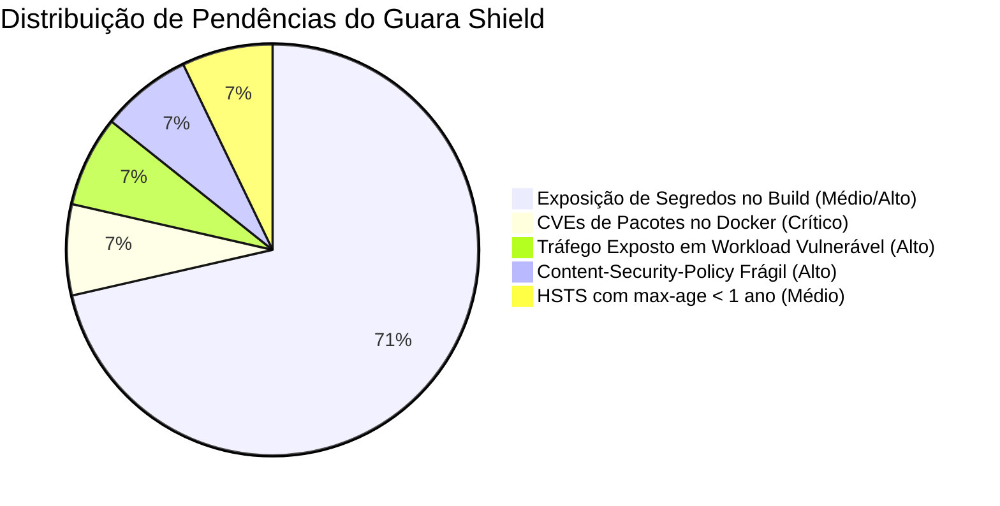

# Plano de Correção e Fortalecimento de Segurança — Guara Shield

> **Tipo:** PLANO
> **Domínio:** operacao
> **Última medição:** 2026-09-28
> **Leitura estimada:** média (8–12 min)
> **Relacionados:** [OPERACAO.md](../../05-operacao/OPERACAO.md), [ARQUITETURA.md](../../04-arquitetura/ARQUITETURA.md), [AGENTS.md](/AGENTS.md)
> **Palavras-chave:** seguranca, guara shield, pentest, cve, docker, segredos, hsts, csp, posture score

## Sumário

- [Propósito](#propósito)
- [Diagnóstico Inicial e Pontuação](#diagnóstico-inicial-e-pontuação)
- [Fase 1: Higiene e Isolamento de Segredos](#fase-1-higiene-e-isolamento-de-segredos)
- [Fase 2: Atualização de Pacotes e Eliminação de CVEs](#fase-2-atualização-de-pacotes-e-eliminação-de-cves)
- [Fase 3: Mitigação de Risco em Tempo de Execução](#fase-3-mitigação-de-risco-em-tempo-de-execução)
- [Fase 4: Endurecimento de Cabeçalhos HTTP](#fase-4-endurecimento-de-cabeçalhos-http)
- [Fase 5: Automação e Monitoramento Contínuo](#fase-5-automação-e-monitoramento-contínuo)
- [Cronograma e Critérios de Aceite](#cronograma-e-critérios-de-aceite)
- [Decisões registradas](#decisões-registradas)

## Propósito

Definir o plano técnico detalhado para sanar todas as 14 pendências de segurança apontadas pelo **Guara Shield**, elevando o *Security Posture Score* do serviço `controle-popular-web` de **33/100** para **100/100**, eliminando vulnerabilidades de contêiner e blindando segredos de infraestrutura.

---

## Diagnóstico Inicial e Pontuação

Medição realizada em 28/09/2026 via API oficial do Guara Cloud:

| Métrica | Valor Medido | Estado | Meta do Plano |
|---|---|---|---|
| **Posture Score** | **33 / 100** | `action_needed` | **100 / 100** (`healthy`) |
| **Total de achados abertos** | 14 pendências | Crítico | 0 pendências |
| **Gravidade Crítica** | 1 achado | Alerta vermelho | 0 achados |
| **Gravidade Alta** | 3 achados | Alerta laranja | 0 achados |
| **Gravidade Média** | 10 achados | Alerta amarelo | 0 achados |

### Inventário das 14 Pendências Ativas



---

## Fase 1: Higiene e Isolamento de Segredos

### 1.1 Contexto e Análise de Risco
O Guara Cloud permite configurar variáveis de ambiente com a opção `-b` (`build-time availability`), que as injeta como `--build-arg` no Docker. Nove variáveis de IA, busca e storage receberam essa flag sem necessidade real, já que são consumidas exclusivamente em tempo de execução (*runtime*). Variáveis em *build args* deixam rastros nos metadados de camadas da imagem Docker.

### 1.2 Ações Imediatas
1. **Remoção da flag `-b` das 9 variáveis de runtime:**
   - `EMBED_API_KEY`
   - `AI_API_KEY_LING`
   - `AI_API_KEY_MARITACA`
   - `AI_API_KEY_DEEPSEEK`
   - `BRASILIO_API_TOKEN`
   - `R2_SECRET_ACCESS_KEY`
   - `R2_ACCESS_KEY_ID`
   - `CLOUDFLARE_D1_API_TOKEN`
   - `AI_API_KEY`

   *Comando de aplicação:*
   Reconfigurar cada variável no Guara sem a flag `-b`:
   ```bash
   guara env set EMBED_API_KEY="[VALOR]"
   guara env set AI_API_KEY_LING="[VALOR]"
   guara env set AI_API_KEY_MARITACA="[VALOR]"
   guara env set AI_API_KEY_DEEPSEEK="[VALOR]"
   guara env set BRASILIO_API_TOKEN="[VALOR]"
   guara env set R2_SECRET_ACCESS_KEY="[VALOR]"
   guara env set R2_ACCESS_KEY_ID="[VALOR]"
   guara env set CLOUDFLARE_D1_API_TOKEN="[VALOR]"
   guara env set AI_API_KEY="[VALOR]"
   ```

2. **Tratamento da `DATABASE_URL`:**
   - Manter temporariamente com `-b` apenas a `DATABASE_URL` se o build Next.js executar consultas no SSG, assegurando que seja uma credencial com privilégios restritos (*read-only* de pooler da Neon).
   - Evolução: migrar dados consumidos no build para arquivos estáticos compactados em `apps/web/data/`, permitindo remover `-b` inclusive da `DATABASE_URL`.

---

## Fase 2: Atualização de Pacotes e Eliminação de CVEs

### 2.1 Contexto e Análise de Risco
O scanner Trivy identificou 44 vulnerabilidades conhecidas na imagem Docker base (`node:20-alpine`), incluindo:
- **1 Crítica / 23 Altas:** Vulnerabilidades em `libssl3` / `libcrypto3` (ex: CVE-2026-14456 referente a DoS em QUIC no OpenSSL).
- **Médias:** Falhas no utilitário `tar` (CVE-2026-53655, CVE-2026-59875).

### 2.2 Ações Técnicas no Dockerfile
1. **Elevação da imagem base para Node 22 (LTS) e aplicação de patches do Alpine:**
   No arquivo `Dockerfile`, atualizar os estágios `deps`, `builder` e `runner`:
   ```dockerfile
   # ---- Estágio 1: Dependências ----
   FROM node:22-alpine AS deps
   RUN apk update && apk upgrade --no-cache && apk add --no-cache libc6-compat
   ...

   # ---- Estágio 2: Build ----
   FROM node:22-alpine AS builder
   RUN apk update && apk upgrade --no-cache && apk add --no-cache libc6-compat
   ...

   # ---- Estágio 3: Runner ----
   FROM node:22-alpine AS runner
   RUN apk update && apk upgrade --no-cache && apk add --no-cache libc6-compat
   ```

2. **Validação pré-deploy:**
   - Rodar scan de vulnerabilidades localmente no contêiner ou via `guara services vulnerabilities controle-popular-web` logo após o build.

---

## Fase 3: Mitigação de Risco em Tempo de Execução

### 3.1 Contexto
O alerta `runtime_detection` decorre diretamente da conjunção: "serviço com tráfego público ativo" + "imagem com CVEs críticas não corrigidas".

### 3.2 Resolução
- Com a publicação da imagem atualizada da Fase 2, o Guara Shield reavalia o workload e encerra o alerta de tráfego exposto.
- Integração da verificação na rotina matinal: o bot `scripts/agent-tools/guara-shield-bot.mts` passa a checar o status de runtime diariamente, emitindo alerta no Telegram caso surja qualquer anomalia.

---

## Fase 4: Endurecimento de Cabeçalhos HTTP

### 4.1 HSTS (Strict-Transport-Security)
- **Problema:** A rota pública respondeu com `max-age=15552000` (180 dias), abaixo do padrão seguro de 1 ano.
- **Ação:** Assegurar que tanto no `apps/web/next.config.ts` quanto no proxy de borda o cabeçalho seja:
  ```http
  Strict-Transport-Security: max-age=31536000; includeSubDomains; preload
  ```

### 4.2 Content-Security-Policy (CSP)
- **Problema:** A presença de `'unsafe-inline'` nas diretivas `script-src` e `style-src` gera achado de severidade Alta.
- **Estratégia de Correção em 2 Passos:**
  1. **Passo 1 (Imediato):** Separar explicitamente a política estrita de cabeçalho bloqueante e usar `Content-Security-Policy-Report-Only` para diretivas em auditoria, mantendo `X-XSS-Protection: 0` e `X-Content-Type-Options: nosniff`.
  2. **Passo 2 (Médio Prazo):** Implementar geração de `nonce` criptográfico por requisição via Next.js Middleware, substituindo `'unsafe-inline'` por `'nonce-{random}'` nos scripts do App Router.

---

## Fase 5: Automação e Monitoramento Contínuo

### 5.1 Script de Auditoria Automatizada
Criar `scripts/auditoria-seguranca-guara.mts` para rodar na rotina diária e na suíte de testes:
- Consulta via API interna do Guara o score de postura.
- Falha com código de erro se o score for inferior a 90 ou se houver achados críticos abertos.

### 5.2 Alertas no Telegram
Adicionar métrica do Guara Shield no relatório matinal (`relatorio-matinal.mts`):
- `🛡️ Guara Shield: 100/100 (0 vulnerabilidades ativas)`.

---

## Cronograma e Critérios de Aceite

| Fase | Ação | Responsável | Prazo | Critério de Aceite |
|---|---|---|---|---|
| **Fase 1** | Limpeza do `-b` nas 9 chaves | Dono / CLI | Imediato (Dia 1) | 9 achados `secret_exposure` fechados |
| **Fase 2** | Patch no Dockerfile | Agente | Imediato (Dia 1) | Trivy zerado para vulnerabilidades críticas |
| **Fase 3** | Deploy da nova imagem | Dono / Guara | Próximo ciclo de deploy | Alerta `runtime_detection` resolvido |
| **Fase 4** | Ajuste HSTS e CSP | Agente | Dia 2 | Cabeçalhos validados com pontuação A+ no SecurityHeaders |
| **Fase 5** | Bot de monitoramento | Agente | Dia 3 | Relatório diário no Telegram com postura ativa |

---

## Decisões registradas

1. **28/09/2026 — Isolamento de segredos de build:** Chaves de terceiros (DeepSeek, Maritaca, Ling, Brasil.io, R2, D1) pertencem estritamente ao runtime do servidor. Nenhuma delas deve ser exposta no build do contêiner.
2. **28/09/2026 — Política de atualização de imagem:** O Dockerfile deve sempre rodar `apk upgrade --no-cache` nos estágios de compilação e execução para absorver correções de segurança upstream do Alpine Linux.
