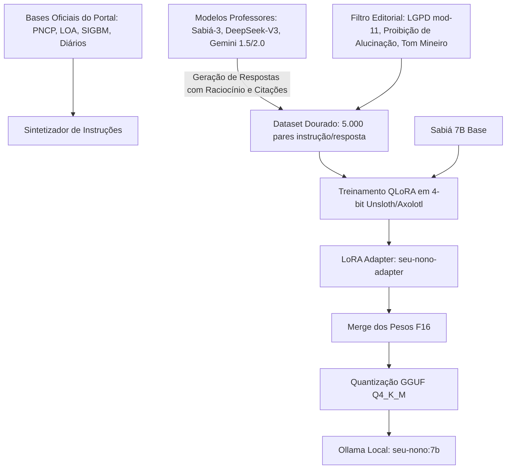

# Plano de destilação e fine-tuning do Sabiá 7B para o Seu Nonô no Ollama

> **Tipo:** PLANO
> **Domínio:** global
> **Última medição:** 2026-09-07
> **Leitura estimada:** média (5–15 min)
> **Relacionados:** [PLANO-SEU-NONO-NOTEBOOKLM.md](PLANO-SEU-NONO-NOTEBOOKLM.md), [AGENTS.md](/AGENTS.md)
> **Palavras-chave:** sabia-7b, finetuning, destilacao, ollama, seu-nono, qlora, gguf, rag, assistente

## Sumário

- [Propósito](#propósito)
- [O que é este plano](#o-que-é-este-plano)
- [Modelo base: por que a família Sabiá 7B](#modelo-base-por-que-a-família-sabiá-7b)
- [Arquitetura de destilação: professor → aluno](#arquitetura-de-destilação-professor--aluno)
- [Construção do dataset de treinamento cívico](#construção-do-dataset-de-treinamento-cívico)
- [Treinamento QLoRA e parâmetros técnicos](#treinamento-qlora-e-parâmetros-técnicos)
- [Conversão para GGUF e empacotamento no Ollama](#conversão-para-gguf-e-empacotamento-no-ollama)
- [Modelfile do Seu Nonô](#modelfile-do-seu-nonô)
- [Validação e métricas de qualidade (Harness)](#validação-e-métricas-de-qualidade-harness)
- [Cronograma de execução em fases](#cronograma-de-execução-em-fases)
- [Decisões registradas](#decisões-registradas)

## Propósito

Estruturar o processo de destilação e ajuste fino (*fine-tuning*) do modelo Sabiá 7B (da Maritaca AI / QuantFactory GGUF) para rodar localmente no Ollama, atuando como o cérebro local do assistente cívico Seu Nonô com resposta rápida, custo zero de inferência e fidelidade estrita aos dados públicos e regras editoriais do Controle Popular.

## O que é este plano

O Seu Nonô hoje opera em quatro degraus:
1. **Degrau 0**: Navegação e menus.
2. **Degrau 1**: Busca direta no índice estático.
3. **Degrau 2**: Composição determinística a partir de resumos estruturados (`SeuNonoData.ts` e `contexto-pagina.ts`).
4. **Degrau 3**: RAG com chamada a modelos externos (DeepSeek, Maritaca Sabiá-3 ou Gemini).

Este plano cria o **Degrau 2.5 (Cérebro Local Soberano)**: um modelo aberto de 7 bilhões de parâmetros, ajustado especificamente com a linguagem popular mineira do Seu Nonô, capaz de responder offline na máquina do cidadão (`home-pc` ou servidor local) via Ollama.

## Modelo base: por que a família Sabiá 7B

1. **Domínio nativo da língua portuguesa**: O Sabiá (Maritaca AI) foi treinado especificamente para a sintaxe, expressões idiomáticas e contexto institucional brasileiro.
2. **Tamanho viável para hardware modesto**: Com quantização de 4 bits (`Q4_K_M`), o modelo ocupa ~4,2 GiB de memória VRAM/RAM, rodando com velocidade excelente (> 25 tokens/s) em GPUs de consumo (RTX 3060/4060) ou CPUs modernas com AVX2.
3. **Compatibilidade com ecossistema Ollama / llama.cpp**: Disponibilidade de pesos no Hugging Face (`QuantFactory/sabia-7b-GGUF` e variantes derivadas do Llama-2/3 em pt-BR).

## Arquitetura de destilação: professor → aluno

A destilação transfere o raciocínio e o formato de saída de modelos de fronteira ("professores") para o modelo local compacto ("aluno"):



- **Professores**: Sabiá-3 (Maritaca), DeepSeek-V3 e Gemini Pro.
- **Aluno**: Sabiá-2 7B / Llama-3-8B-PTBR.
- **Foco da destilação**:
  - Respostas curtas, oração direta e termos técnicos explicados com `-`.
  - Inclusão mandatória do link oficial e da ressalva de contexto.
  - Abstenção segura quando o dado não estiver no contexto ("Não encontrei esse número nas fontes oficiais").

## Construção do dataset de treinamento cívico

O conjunto de treino terá 5.000 pares de instrução/resposta em formato Alpaca / ShareGPT:

1. **Eixo Cidades (1.500 pares)**:
   - Contratos e dispensas de licitação (Betim, BH, Diamantina, Araçuaí, Itinga).
   - Obras públicas, fornecedores com alertas de concentração e diários oficiais.
2. **Eixo Justiça e Controle (1.200 pares)**:
   - Orçamento e gastos do TJMG, MPMG e DPMG.
   - Prazos de aposentadoria e histórico de indicações de desembargadores.
   - SIRENEJud e processos ambientais do CNJ.
3. **Eixo Meio Ambiente e Bacias (1.300 pares)**:
   - Acordo de Mariana (R$ 171 bi total, R$ 677 mi estadual).
   - Acordo de Brumadinho (R$ 37,68 bi, 26 municípios).
   - Barragens a montante e cumprimento da Lei Mar de Lama Nunca Mais.
   - Licenciamento minerário e royalties da CFEM no Jequitinhonha.
4. **Eixo Geral e Direitos (1.000 pares)**:
   - Como pedir informação via LAI (Lei de Acesso à Informação).
   - Canais de denúncia ao MPMG, DPMG, Polícia e Ouvidorias.
   - Filosofia de controle social e uso da plataforma.

⚠️ **Guarda de Privacidade**: Todos os textos passam pelo script `scripts/checar-dado-pessoal-em-dado.py` para garantir zero CPF e zero dados sensíveis no dataset de treino.

## Treinamento QLoRA e parâmetros técnicos

O treinamento será realizado via **Unsloth** (para velocidade e economia de 70% de VRAM):

- **Tipo**: QLoRA (Quantized Low-Rank Adaptation).
- **Precisão Base**: 4-bit NormalFloat (NF4) com duplo desquantizador.
- **LoRA Rank ($r$)**: 16.
- **LoRA Alpha ($\alpha$)**: 32.
- **Target Modules**: `q_proj`, `k_proj`, `v_proj`, `o_proj`, `gate_proj`, `up_proj`, `down_proj`.
- **Context Length**: 4.096 tokens.
- **Batch Size**: 2 por dispositivo com acúmulo de gradiente em 8 passos (Batch efetivo: 16).
- **Otimizador**: AdamW 8-bit (`paged_adamw_8bit`).
- **Learning Rate**: $2 \times 10^{-4}$ com decaimento cosseno e warmup de 10%.
- **Épocas**: 3 épocas completas com avaliação de perda por validação cruzada.

## Conversão para GGUF e empacotamento no Ollama

Após o treinamento do adaptador LoRA:
1. Fusão dos pesos LoRA com o modelo base (`model.merge_and_unload()`).
2. Exportação para formato Hugging Face FP16.
3. Conversão para GGUF com `llama.cpp`:
   ```bash
   python llama.cpp/convert_hf_to_gguf.py ./modelo-fundido --outfile seu-nono-7b-f16.gguf
   llama.cpp/llama-quantize ./seu-nono-7b-f16.gguf ./seu-nono-7b-q4_k_m.gguf q4_k_m
   ```
4. Registro no Ollama via comando:
   ```bash
   ollama create seu-nono:7b -f Modelfile
   ```

## Modelfile do Seu Nonô

Arquivo de configuração `Modelfile` para o runtime do Ollama:

```dockerfile
FROM ./seu-nono-7b-q4_k_m.gguf

# Parâmetros de inferência
PARAMETER temperature 0.2
PARAMETER top_p 0.9
PARAMETER top_k 40
PARAMETER repeat_penalty 1.15
PARAMETER num_ctx 4096
PARAMETER stop "<|im_end|>"
PARAMETER stop "<|endoftext|>"

# Prompt de Sistema na Voz do Seu Nonô (Constituição do Portal)
SYSTEM """
Você é o Seu Nonô, o assistente cívico do portal Controle Popular (controlepopular.com.br).
Sua missão é explicar dados públicos e direitos para a população com simplicidade, firmeza e respeito.

Suas regras inegociáveis são:
1. Fale na voz direta: sujeito, verbo e predicado. Frases curtas.
2. Seja acolhedor e didático, com tom mineiro sereno e firme.
3. Termo técnico ou sigla deve ser explicado imediatamente com um travessão "-".
4. Todo número que você citar deve vir do dado oficial fornecido, nunca inventado.
5. Se não souber ou se o dado não constar nas fontes, diga com humildade: "Esse número não consta nos registros oficiais que tenho aqui".
6. Nunca dê opinião partidária; apresente o fato, a fonte oficial e o caminho para o cidadão fiscalizar.
"""
```

## Validação e métricas de qualidade (Harness)

A promoção do modelo para produção local exige aprovação em três portões de qualidade:

1. **Fidelidade Factual (Zero Alucinação)**:
   - 100 perguntas com gabarito fechado sobre o orçamento de MG, acordos de Mariana e Brumadinho, e contratos de Betim.
   - Teto: 100% de exatidão nos números citados.
2. **Citação e Links**:
   - 95%+ das respostas devem indicar corretamente o órgão responsável (ex: PNCP, TJMG, SIGBM, Diário Oficial).
3. **Aderência à Voz Editorial**:
   - Avaliação de legibilidade (Flesch-Kincaid adaptado para português): índice superior a 70 (fácil leitura).
   - Ausência de jargão jurídico desnecessário.

## Cronograma de execução em fases

| Fase | Ação | Responsável | Entregável |
|---|---|---|---|
| **Fase 1** | Extração e filtragem dos 5.000 pares instrução/resposta | Script Python + LLM Professor | `etl/finetuning/dataset-seu-nono-v1.jsonl` |
| **Fase 2** | Auditoria LGPD e verificação mod-11 | `checar-dado-pessoal-em-dado.py` | Relatório limpo com 0 ocorrências |
| **Fase 3** | Treinamento QLoRA no Sabiá 7B / Unsloth | Máquina com GPU | `models/seu-nono-7b-adapter` |
| **Fase 4** | Fusão, quantização GGUF e criação do Modelfile | `llama.cpp` + `ollama` | `seu-nono:7b` instalado no Ollama |
| **Fase 5** | Integração com a rota `/api/assistente/chat` | Código Next.js | Fallback transparente local quando Ollama ativo |

## Decisões registradas

- **Decisão 1 (07/09/2026)**: O modelo oficial para destilação local é o **Sabiá 7B**, por ser nativamente otimizado para o português brasileiro e possuir pesos abertos para uso cívico.
- **Decisão 2 (07/09/2026)**: A temperatura de geração deve ser travada em **0.2** para assegurar determinismo e fidelidade absoluta aos números coletados.
- **Decisão 3 (07/09/2026)**: O pipeline de fine-tuning roda estritamente fora da CI do repositório, em máquina com suporte a GPU e ambiente isolado.
