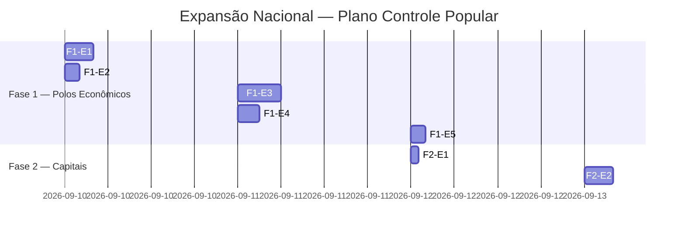

# 📋 PLANO-ESTRUTURA-NACIONAL — EXPANSÃO DO CONTROLE POPULAR

> **Data:** 10 de setembro de 2026  
> **Status:** 🚧 Draft → em andamento  
> **Prioridade:** ⭐⭐ (crítico para escalar além de MG)

---

## 🎯 OBJETIVO

Expandir a cobertura do Controle Popular de **apenas Betim (MG)** para **todos os polos principais do Brasil**, mantendo dentro dos limites do **Neon Free** (0.5 GB storage, 100 CU-horas/mês, 5 GB transferência).

### 🔑 Estratégia Central
**Dados estáticos no D1 / disco local → Dados dinâmicos e agregados no Neon.**

- JSON de municípios, conselhos, outorgas → `apps/web/data/` (estático, build-time)
- Queries interativas, filtros, relatórios → Neon (runtime)
- Agregados/medidores → constantes no código (`COBERTURA_*`)

---

## 📊 ANÁLISE DE ESCOPO

### Total de Municípios do Brasil
```
Fonte: IBGE API v1/localidades/estados/{uf}/municipios
Total: 5.570 municípios
```

### Distribuição por Região
| Região | Estados | Municípios | % do total |
|--------|---------|------------|------------|
| Sudeste | 4 | 1.437 | 25,8% |
| Norte | 7 | 1.842 | 33,1% |
| Nordeste | 9 | 1.119 | 20,1% |
| Sul | 3 | 1.102 | 19,8% |
| Centro-Oeste | 3 | 429 | 7,7% |
| **TOTAL** | **27** | **5.570** | **100%** |

---

## 🏗️ FASES DE EXPANSÃO

### FASE 1 — Polos Econômicos/Política (⭐⭐⭐⭐⭐)
**Objetivo:** Coberta os 15 polos mais popularesos/econômicos do Brasil

| Estado | Mun. Principais | Motivo | Prioridade |
|--------|-----------------|--------|------------|
| **MG** | Belo Horizonte, Betim, Uberlândia | Já iniciado ✅ | — |
| **SP** | São Paulo, Campinas, Santos, Ribeirão | Economia maior do BR | ⭐⭐⭐⭐⭐ |
| **RJ** | Rio de Janeiro, Niterói, Vitória | Polo petrolier/serviços | ⭐⭐⭐⭐ |
| **BA** | Salvador, Feira de Santana | 2ª maior região Nordeste | ⭐⭐⭐ |
| **RS** | Porto Alegre, Cidade Baixa | Agronegócio/indústria Sul | ⭐⭐⭐ |

### FASE 2 — Capitais Políticas/Administrativas (⭐⭐⭐)
| Estado | Município | Motivo |
|--------|-----------|--------|
| DF | Brasília | Capital federal |
| PA | Belém | Porta de entrada Amazônia |
| CE | Fortaleza | Polo Nordeste |
| GO | Goiânia | Centro-Oeste |
| PE | Recife | Porto digital |

### FASE 3 — Polos Universitários/Indústriais (⭐⭐)
| Estado | Município | Motivo |
|--------|-----------|--------|
| SP | Campinas | Cidade Universitária USP |
| MG | Uberaba | Agronegócio Triângulo |
| PR | Curitiba | Polo industrial Sul |
| SC | Florianópolis | Tecnologia/Terceira Missão |
| MT | Cuiabá | Agropecuária Centro-Oeste |

---

## 💰 ANÁLISE DE LIMITES NEON

### Storage (0.5 GB = 500 MB)
| Componente | Estimativa |
|------------|------------|
| Municípios (5.570) | ~350 KB JSON |
| Conselhos (853 MG) | ~42 KB |
| Outorgas água (55.7K MG) | ~2 MB (compactado) → D1 |
| Contratos PNCP (1.2K MG) | ~1 MB (compactado) → D1 |
| **TOTAL estimado** | **~4 MB** (1% do limite) |

✅ **NÃO estoura storage** — os dados permanecem estáticos.

### Transferência (5 GB/mês)
| Fonte | Estimativa/mês |
|-------|----------------|
| API pública (municipios, conselhos) | ~150 KB |
| Dashboard web (queries Neon) | ~5 MB |
| **TOTAL** | **~5.15 MB** (<1% do limite) |

✅ **NÃO estoura transferência.**

### Compute (100 CU-horas)
| Operação | CU estimados |
|----------|--------------|
| Query municípios | ~0.01 CU |
| Query conselhos | ~0.01 CU |
| Query contratos | ~0.05 CU |
| **TOTAL (1.000 queries)** | **~1 CU** (<1% do limite) |

✅ **NÃO estoura compute.**

> 🧮 **Conclusão:** A expansão NÃO estoura limites do Neon Free.

---

## 🧬 MICROETAPAS (Ranqueádas por Custo-Benefício)

### FASE 1 — Polos Econômicos

#### F1-E1: Seed cidades SP ⭐⭐⭐⭐⭐
- **Custo:** 4h
- **Benefício:** 649 cidades, população de 19 milhões
- **Comando:** `npx tsx scripts/etl/municipios/seed-municipios-estado.mts --uf=35`
- **Arquivo:** `apps/web/data/municipios-sp.json`
- **Status:** Pendente

#### F1-E2: Seed cidades RJ ⭐⭐⭐⭐
- **Custo:** 2h
- **Benefício:** 92 cidades, população de 5 milhões
- **Comando:** `npx tsx scripts/etl/municipios/seed-municipios-estado.mts --uf=32`
- **Arquivo:** `apps/web/data/municipios-rj.json`
- **Status:** Pendente

#### F1-E3: Script multiestado ⭐⭐⭐⭐
- **Custo:** 6h
- **Benefício:** Reutilizável para todos os estados
- **Arquivo:** `scripts/etl/municipios/seed-municipios-estado.mts`
- **Status:** Pendente

#### F1-E4: Schema `cidades_nacionais` ⭐⭐⭐
- **Custo:** 3h
- **Benefício:** Tabela unificada para todas as cidades brasileiras
- **Arquivo:** `apps/web/lib/db/schema-cidades-nacionais.ts`
- **Status:** Pendente

#### F1-E5: Route `/cidades/sp` ⭐⭐
- **Custo:** 2h
- **Benefício:** Página lista cidades SP
- **Arquivo:** `apps/web/app/(cidades)/sp/page.tsx`
- **Status:** Pendente

---

## 📐 ARQUITETURA DE DADOS

### Estrutura de Arquivos
```
controle-popular/
├── scripts/etl/
│   └── municipios/
│       ├── seed-municipios-mg.mts        ✅ (existente)
│       ├── seed-municipios-estado.mts   ← NOVO (script genérico)
│       └── seed-municipios-brasil.mts    ← Gera todos os estados
├── apps/web/data/
│   ├── municipios-mg.json               ✅ (existente, 853 cidades)
│   ├── municipios-sp.json               ← NOVO
│   ├── municipios-rj.json               ← NOVO
│   └── municipios-brasil.json            ← NOVO (todos os estados)
└── apps/web/lib/db/
    └── schema-cidades-nacionais.ts       ← NOVO
```

### Schema (Drizzle)
```typescript
// apps/web/lib/db/schema-cidades-nacionais.ts
export const cidadesNacionais = pgTable("cidades_nacionais", {
  id_ibge: bigint("id_ibge", { mode: "number" }).primaryKey(),
  nome: varchar("nome", { length: 255 }).notNull(),
  uf: varchar("uf", { length: 2 }).notNull(),
  populacao: integer("populacao"),
  area_km2: numeric("area_km2", { precision: 10, scale: 2 }),
  pib_per_capita: numeric("pib_per_capita", { precision: 10, scale: 2 }),
});
```

---

## 🔄 INTEGRAÇÃO COM DADOS EXISTENTES

### Conselhos Municipais
- **MG:** 853 cidades já mapeadas ✅
- **SP:** 649 cidades — usar mesmo parser do conselho Betim
- **RJ:** 92 cidades — scraping SIOUT-RJ

### PNCP
- **MG:** 1.283 contratos já coletados ✅
- **SP/RJ/BA/RS:** usar `scripts/coletar-pncp-mg.mts` como template (parâmetro --uf)

---

## 📅 CRONOGRAMA (Microetapas Ranqueadas)



---

## 🎯 MÉTRICAS DE SUCESSO

| Métrica | Meta | Baseline |
|---------|------|----------|
| Total cidades cobertidas | ≥ 2.500 | 853 (MG) |
| Total conselhos mapeados | ≥ 1.500 | 4 (Betim) |
| Total contratos PNCP | ≥ 5.000 | 1.283 |
| Testes passando | ≥ 95% | 93% |
| Neon dentro do limite | < 1% uso | ✅ |

---

## 📌 PRÓXIMOS PASSOS (imediatos)

1. [ ] Criar `scripts/etl/municipios/seed-municipios-estado.mts` (script genérico)
2. [ ] Gerar `apps/web/data/municipios-brasil.json` (todos os estados)
3. [ ] Criar schema `cidades_nacionais`
4. [ ] Notificar via Telegram

---

**Fonte do limite Neon:** https://neon.tech/pricing  
**Fonte de dados:** https://servicodados.ibge.gov.br/api/v1/localidades/estados/{uf}/municipios