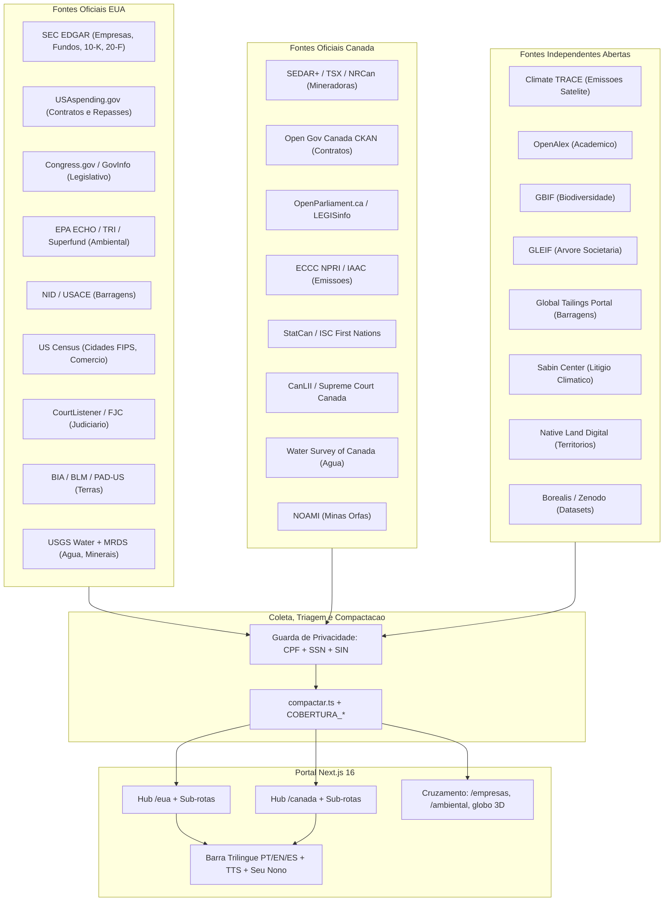
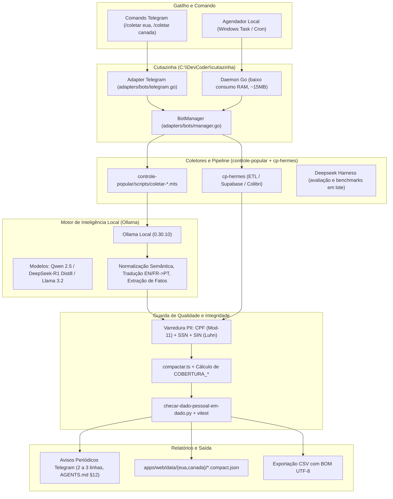

# Plano de Expansão Internacional: Estados Unidos e Canadá

> **Tipo:** PLANO
> **Domínio:** internacional, eua, canada, transnacional
> **Última medição:** 2026-09-29
> **Leitura estimada:** longa (> 15 min)
> **Relacionados:** [AGENTS.md](/AGENTS.md), [PRODUTO.md](../01-produto/PRODUTO.md), [FONTES.md](../06-fontes/FONTES.md), [ARQUITETURA.md](../04-arquitetura/ARQUITETURA.md), [OPERACAO.md](../05-operacao/OPERACAO.md)
> **Palavras-chave:** expansão, internacional, EUA, Canadá, SEC EDGAR, USAspending, EPA, NID, TSX, NPRI, OpenParliament, CanLII, GLEIF, Climate TRACE, OpenAlex, GBIF, BIA, BLM, First Nations, Mount Polley, Superfund, transnacional, mineração, 6 qualidades, trilíngue

## Sumário

- [1. Objetivo e visão geral](#1-objetivo-e-visão-geral)
- [2. Decisões de produto alinhadas com o dev](#2-decisões-de-produto-alinhadas-com-o-dev)
- [3. Arquitetura da expansão](#3-arquitetura-da-expansão)
- [4. Mapeamento das 6 frentes: Brasil × EUA × Canadá](#4-mapeamento-das-6-frentes-brasil--eua--canadá)
- [5. Catálogo completo de fontes e APIs](#5-catálogo-completo-de-fontes-e-apis)
  - [5.1. Eixo Estado, Economia, Executivo e Legislativo](#51-eixo-estado-economia-executivo-e-legislativo)
  - [5.2. Eixo Natureza, Clima, Água e Ciência](#52-eixo-natureza-clima-água-e-ciência)
  - [5.3. Eixo Terra, Territórios, Mineração e Barragens](#53-eixo-terra-territórios-mineração-e-barragens)
  - [5.4. Fontes transnacionais e independentes](#54-fontes-transnacionais-e-independentes)
- [6. Regra das 6 Qualidades aplicada a cada fonte](#6-regra-das-6-qualidades-aplicada-a-cada-fonte)
- [7. Armadilhas medidas e regras de coleta](#7-armadilhas-medidas-e-regras-de-coleta)
- [8. Mudanças propostas por componente](#8-mudanças-propostas-por-componente)
  - [8.1. Guarda de privacidade internacional](#81-guarda-de-privacidade-internacional)
  - [8.2. Sistema trilíngue PT/EN/ES](#82-sistema-trilíngue-ptes)
  - [8.3. Coletores e camada de dados compactados](#83-coletores-e-camada-de-dados-compactados)
  - [8.4. Novas páginas e rotas](#84-novas-páginas-e-rotas)
  - [8.5. Cruzamento nas frentes existentes](#85-cruzamento-nas-frentes-existentes)
- [9. Mineradoras canadenses e americanas no Brasil](#9-mineradoras-canadenses-e-americanas-no-brasil)
- [10. Plano de verificação e testes](#10-plano-de-verificação-e-testes)
- [11. Cronograma e fases](#11-cronograma-e-fases)
- [12. Proposta de automação de coleta: Bot com Cutiazinha, Ollama e Hermes](#12-proposta-de-automação-de-coleta-bot-com-cutiazinha-ollama-e-hermes)
- [Decisões registradas](#decisões-registradas)
- [Origem / Histórico](#origem--histórico)

---

## 1. Objetivo e visão geral

Expandir o portal **Controle Popular** para os **Estados Unidos** e o
**Canadá**, mantendo a mesma lógica cívica, editorial e técnica do Brasil.

Dois recortes complementares:

1. **Conexão Transnacional Brasil ↔ EUA/Canadá:** mineradoras canadenses
   na bolsa TSX operando no Brasil, corporações e fundos dos EUA na SEC
   EDGAR, comércio bilateral e litígios cruzados.
2. **Espelho das 6 Frentes Cívicas:** Cidades/Territórios, Legislativo,
   Judiciário, Função Social da Terra, Desastres/Reparação e Observatório
   Ambiental/Empresas — agora nos EUA e no Canadá.

> [!IMPORTANT]
> **Regras inegociáveis do `AGENTS.md` mantidas na expansão:**
> - Coleção nunca como props de componente de cliente (`compactar.ts`,
>   `COBERTURA_*`, `TabelaEstatica.tsx`).
> - Privacidade na origem: CPF (Mod-11) + SSN (EUA) + SIN (Luhn, Canadá).
> - Regra das 6 Qualidades em toda página de dado.
> - Idioma padrão PT-BR + modo trilíngue PT/EN/ES.

---

## 2. Decisões de produto alinhadas com o dev

Respostas do dev a múltipla escolha (29/09/2026):

| Pergunta | Resposta |
|---|---|
| **Escopo** | Ambos: espelhar as 6 frentes nos EUA/Canadá **e** conexão transnacional com o Brasil (mineração, SEC, TSX, fundos) |
| **Organização de rotas** | Criar hubs `/eua` e `/canada` com sub-rotas temáticas + cruzar nas frentes atuais (`/empresas`, `/ambiental`, globo 3D) |
| **Idioma** | PT-BR padrão com leitura trilíngue PT/EN/ES e modo de exibição adaptado nas principais partes, com botão ou chatbot |

---

## 3. Arquitetura da expansão



---

## 4. Mapeamento das 6 frentes: Brasil × EUA × Canadá

| Frente | Equivalente EUA (`/eua/*`) | Equivalente Canadá (`/canada/*`) | Conexão transnacional |
|---|---|---|---|
| **1. Cidades e Territórios** | Cidades-polo e estados (`/eua/cidades`): código **FIPS** 5 dígitos. NY, DC, Houston, LA, Miami, Detroit | Cidades-polo e províncias (`/canada/cidades`): código **SGC** 7 dígitos. Toronto, Vancouver, Montreal, Ottawa, Calgary, **Sudbury** | Comparativo orçamento per capita, impostos minerários (Sudbury × Itabira), repasses |
| **2. Legislativo** | Congresso EUA (`/eua/congresso`): Senado (100) + Câmara (435). Congress.gov, GovTrack, OpenFEC | Parlamento Canadá (`/canada/parlamento`): Câmara dos Comuns (338 MPs) + Senado. OpenParliament.ca, OurCommons | Minerais críticos, acordos comerciais, leis de desmatamento e FCPA |
| **3. Judiciário** | Judiciário Federal + SCOTUS (`/eua/judiciario`): CourtListener, ações de Brumadinho/Mariana em SDNY | Suprema Corte + CanLII (`/canada/judiciario`): *Nevsun v. Araya*, *Choc v. Hudbay* | Litígios transnacionais de mineradoras no exterior |
| **4. Função Social da Terra** | Terras Federais e Indígenas (`/eua/terras`): BIA, BLM, PAD-US/NPS | First Nations e Crown Land (`/canada/terras`): ISC, *Duty to Consult*, CIRNAC | Sobreposição concessões × terras indígenas no globo 3D |
| **5. Desastres e Reparação** | Superfund + NID (`/eua/reparacao`): EPA CERCLA, barragens *High Hazard*, *Consent Decrees* | Mount Polley + NOAMI (`/canada/reparacao`): desastre 2014 BC, minas órfãs, reparações First Nations | Paralelo Mount Polley (2014) × Mariana (2015) × Brumadinho (2019) |
| **6. ONSA: Ambiental e Empresas** | EPA ECHO, TRI, SEC EDGAR (`/eua/ambiental`, `/eua/empresas`) | ECCC NPRI, TSX Mining (`/canada/ambiental`, `/canada/mineracao`) | Rastreamento completo TSX→Brasil: Sigma, Belo Sun, Ero, Equinox, Aura, Lundin, Vale BM |

---

## 5. Catálogo completo de fontes e APIs

Cada fonte traz: nome, tipo, licença, endpoint, link canônico, campos de
busca/filtro, colunas de ordenação, métricas para cartões de topo, tags
para o Seu Nonô, colunas de exportação CSV e armadilhas medidas.

Pausa entre requisições: 1–2 s por host. `User-Agent` honesto:
`ControlePopular/1.0 (+https://controlepopular.com.br; contato@controlepopular.com.br)`.

### 5.1. Eixo Estado, Economia, Executivo e Legislativo

#### 5.1.1. SEC EDGAR API (EUA — Empresas e Fundos)

- **Tipo:** Pública. **Licença:** Domínio público (dados de empresas abertas).
- **Endpoints:**
  - `data.sec.gov/api/xbrl/companyfacts/CIK{10d}.json` — balanços XBRL (ativo, receita, lucro).
  - `efts.sec.gov/LATEST/search-index?q=...&dateRange=...&forms=10-K,20-F` — busca textual full-text.
  - `data.sec.gov/submissions/CIK{10d}.json` — filings, diretores, endereço.
- **Link canônico direto (Q1):** `https://www.sec.gov/cgi-bin/browse-edgar?action=getcompany&CIK={cik}&type=10-K`
- **Busca/Facetas (Q2):** por nome, ticker, SIC (setor), formulário, data, estado.
- **Ordenação (Q3):** por ativo total, receita, data do filing, nome.
- **Cartões de topo (Q4):** total de empresas monitoradas, ativo agregado, número de ADRs brasileiras.
- **Tags Seu Nonô (Q5):** `sec`, `edgar`, `empresa`, `fundo`, `10-K`, `20-F`, `adr`, `investidor`.
- **Colunas CSV (Q6):** CIK, ticker, nome, SIC, estado, ativo_total_usd, receita_usd, data_filing, url_oficial.
- **Armadilhas:** ver §7.

#### 5.1.2. USAspending.gov API v2 (EUA — Contratos e Repasses Federais)

- **Tipo:** Pública. **Licença:** Domínio público.
- **Endpoint:** `api.usaspending.gov/api/v2/search/spending_by_award/` (POST JSON).
  - Também: `/api/v2/awards/{generated_internal_id}/` para detalhe de um contrato.
  - Bulk download: `files.usaspending.gov/generated_downloads/`.
- **Link canônico (Q1):** `https://www.usaspending.gov/award/{generated_unique_award_id}` — usa `generated_internal_id`, **não** o `Award ID` do campo textual.
- **Busca/Facetas (Q2):** agência (CFDA/NAICS), UEI (empresa), estado, ano fiscal, tipo de award.
- **Ordenação (Q3):** valor total, data de início, agência, recipiente.
- **Cartões de topo (Q4):** soma total de contratos, número de awards, top-5 agências.
- **Tags Seu Nonô (Q5):** `usaspending`, `contrato`, `grant`, `repasse`, `federal`, `orçamento`.
- **Colunas CSV (Q6):** award_id, agencia, recipiente_uei, recipiente_nome, valor_usd, data_inicio, data_fim, estado, tipo, url_oficial.
- **Armadilha:** ano fiscal EUA começa em 1º de outubro (FY2026 = out/2025 a set/2026). Valores negativos = estornos legítimos.

#### 5.1.3. Congress.gov e Congress-Legislators (EUA — Legislativo)

- **Tipo:** Pública. **Licença:** Domínio público / CC0 (dados de legisladores via GitHub `unitedstates/congress-legislators`).
- **Endpoints:**
  - `api.congress.gov/v3/bill?api_key={key}` — projetos de lei, co-sponsors, ações.
  - `unitedstates.github.io/congress-legislators/legislators-current.json` — CC0, sem API key, resolve 100% dos parlamentares.
  - `voteview.com` — votações nominais históricas (DW-NOMINATE scores).
- **Link canônico (Q1):** `https://www.congress.gov/bill/{congress}th-congress/{chamber}-bill/{number}`
- **Busca/Facetas (Q2):** partido, estado, comissão, tema (minerais críticos, clima, comércio).
- **Ordenação (Q3):** data, partido, estado, nome.
- **Cartões de topo (Q4):** total senadores/deputados, projetos por tema, composição partidária.
- **Tags Seu Nonô (Q5):** `congresso`, `senador`, `deputado`, `projeto de lei`, `votação`, `comissão`.
- **Colunas CSV (Q6):** id, nome, partido, estado, cargo, comissoes, data_inicio_mandato, url_oficial.

#### 5.1.4. OpenFEC / FEC (EUA — Financiamento Eleitoral)

- **Tipo:** Pública. **Licença:** Domínio público.
- **Endpoint:** `api.open.fec.gov/v1/candidates/?api_key={key}` — candidatos, comitês, doações.
- **Link canônico (Q1):** `https://www.fec.gov/data/candidate/{candidate_id}/`
- **Busca/Facetas (Q2):** candidato, comitê, doador, ciclo eleitoral, partido, estado.
- **Armadilha:** API key gratuita mas obrigatória; rate limit 1.000 req/hora.

#### 5.1.5. LDA.gov (EUA — Lobby Disclosure)

- **Tipo:** Pública. **Licença:** Domínio público.
- **Endpoint:** `lda.senate.gov/api/v1/filings/` — registros de lobby no Senado.
- **Link canônico (Q1):** `https://lda.senate.gov/filings/public/filing/{filing_uuid}/`

#### 5.1.6. CourtListener / Free Law Project (EUA — Judiciário)

- **Tipo:** Pública sem fins lucrativos. **Licença:** CC BY-NC (texto das decisões é domínio público).
- **Endpoints:**
  - `www.courtlistener.com/api/rest/v4/search/?q=Brumadinho&type=o` — busca textual de opiniões.
  - `www.courtlistener.com/api/rest/v4/dockets/?court=scotus` — dockets da Suprema Corte.
  - Bulk data: `storage.courtlistener.com/bulk-data/`.
- **Link canônico (Q1):** `https://www.courtlistener.com/opinion/{id}/{slug}/`
- **Busca/Facetas (Q2):** corte, juiz, data, tipo de caso, partes, texto livre.
- **Ordenação (Q3):** data da decisão, relevância, corte.
- **Cartões de topo (Q4):** total de decisões indexadas, processos contra mineradoras brasileiras, ações ambientais.
- **Tags Seu Nonô (Q5):** `judiciário`, `suprema corte`, `ação coletiva`, `ambiental`, `class action`.
- **Armadilha:** API key gratuita; sem key = 100 req/dia, com key = 5.000 req/dia. Dados de PACER (processos em andamento) são pagos — usar apenas texto de decisões publicadas.

#### 5.1.7. US Census Bureau API (EUA — Cidades e Comércio)

- **Tipo:** Pública. **Licença:** Domínio público.
- **Endpoints:**
  - `api.census.gov/data/timeseries/intltrade/exports/hs?get=...&CTY_CODE=3510` — comércio EUA × Brasil.
  - `api.census.gov/data/2022/acs/acs5?get=B01003_001E,B19013_001E&for=place:*&in=state:*` — população e renda por cidade.
- **Link canônico (Q1):** `https://data.census.gov/profile/{FIPS_CODE}` para cidades.
- **Busca/Facetas (Q2):** estado, condado, cidade (FIPS), ano, variável (população, renda, pobreza).
- **Ordenação (Q3):** população, renda mediana, taxa de pobreza, código FIPS.
- **Cartões de topo (Q4):** população total das cidades-polo, renda mediana, balança comercial EUA-Brasil.
- **Armadilha:** valores ausentes codificados como `-666666666` ou `-888888888` (NÃO são zero). Resposta é Array-of-Arrays, não objetos JSON.

#### 5.1.8. Open Government Canada — CKAN (Canadá — Contratos e Grants)

- **Tipo:** Pública. **Licença:** Open Government Licence – Canada (equivalente a CC-BY).
- **Endpoint:** `open.canada.ca/data/api/3/action/package_show?id={dataset_id}` — CKAN padrão.
  - Proactive Disclosure de contratos: `open.canada.ca/data/dataset/d8f85ad2-...`
  - Grants & Contributions: `open.canada.ca/data/dataset/432527ab-...`
  - Lobbying Registry: `lobbycanada.gc.ca/app/secure/ocl/lrs/do/guest` (CSV).
- **Link canônico (Q1):** `https://open.canada.ca/data/en/dataset/{package_id}`
- **Busca/Facetas (Q2):** organização federal, valor, ano, tipo de contrato, província.
- **Armadilha:** títulos e descrições bilíngues `{"en": "...", "fr": "..."}`. Valores monetários em CSV misturam formato inglês (`1,234.56`) e francês (`1 234,56`). Lobbying divide-se em múltiplos CSVs unidos por `COMLOG_ID`.

#### 5.1.9. OpenParliament.ca e OurCommons (Canadá — Legislativo)

- **Tipo:** Pública. **Licença:** CC BY-SA (OpenParliament), Open Parliament Licence (OurCommons).
- **Endpoints:**
  - `api.openparliament.ca/bills/?format=json` — projetos de lei.
  - `api.openparliament.ca/politicians/?format=json` — deputados (MPs) por riding.
  - `api.openparliament.ca/votes/?format=json` — votações nominais.
  - `ourcommons.ca` XML/JSON — Hansard, comissões, LEGISinfo.
- **Link canônico (Q1):** `https://openparliament.ca/bills/{session}/{bill_number}/`
- **Busca/Facetas (Q2):** sessão, partido, tema, riding (distrito), data.
- **Ordenação (Q3):** data, sessão, partido.
- **Armadilha:** numeração de Bill reinicia a cada `Parliament/Session` (ex.: `44-1`, `45-1`). Chave natural = `session + number`, nunca só o número. `User-Agent` com e-mail obrigatório. Paginação por `offset`/`limit`.

#### 5.1.10. Statistics Canada — StatCan WDS (Canadá — Indicadores Municipais)

- **Tipo:** Pública. **Licença:** Open Government Licence – Canada.
- **Endpoints:**
  - `www150.statcan.gc.ca/t1/wds/rest/getDataFromCubePidCoord` — indicadores por cubo.
  - Census Profile SDMX: `www12.statcan.gc.ca/census-recensement/...`
- **Link canônico (Q1):** `https://www12.statcan.gc.ca/census-recensement/2021/dp-pd/prof/details/page.cfm?DGUID=2021A0005{SGC}`
- **Busca/Facetas (Q2):** código SGC (7 dígitos), província, indicador, ano do censo.
- **Armadilha:** nunca casar por nome de cidade (grafia em inglês, francês e línguas originárias diverge). Usar código SGC sempre, equivalente ao IBGE 7 dígitos.

#### 5.1.11. SEDAR+ e TSX (Canadá — Empresas de Capital Aberto)

- **Tipo:** Pública/Privada de livre acesso. **Licença:** acesso aberto com termos de uso.
- **Endpoint:** `www.sedarplus.ca` — portal unificado de filings de empresas no Canadá.
- **Link canônico (Q1):** `https://www.sedarplus.ca/csa-party/records/record.html?id={filing_id}`
- **Armadilha:** SEDAR+ substituiu o antigo SEDAR em 2023. Busca textual exige nome exato da empresa. Dados financeiros mais profundos exigem login gratuito.

#### 5.1.12. CanLII (Canadá — Judiciário)

- **Tipo:** Pública sem fins lucrativos. **Licença:** uso não comercial (texto das decisões é público).
- **Endpoint:** `api.canlii.org/v1/caseBrowse/{lang}/{databaseId}?api_key={key}` — decisões por corte.
- **Link canônico (Q1):** `https://www.canlii.org/en/ca/scc/doc/{year}/{year}scc{number}/{year}scc{number}.html`
- **Busca/Facetas (Q2):** corte, data, jurisdição, termo de busca, legislação citada.
- **Armadilha:** API key gratuita disponível para projetos acadêmicos e cívicos. A busca textual é limitada a 50 resultados por página.

#### 5.1.13. GLEIF — Global LEI Foundation (Transnacional — Árvore Societária)

- **Tipo:** Privada de livre acesso (ONG global). **Licença:** CC0 (dados LEI são domínio público).
- **Endpoint:** `api.gleif.org/api/v1/lei-records?filter[entity.legalName]={nome}` — 100% aberta, sem chave.
  - Relacionamentos pai/filha: `api.gleif.org/api/v1/lei-records/{LEI}/direct-parent`
  - Filtro por país: `filter[entity.legalAddress.country]=BR`
- **Link canônico (Q1):** `https://search.gleif.org/#/record/{LEI}`
- **Busca/Facetas (Q2):** nome, LEI, país, status (ativo/inativo), tipo de entidade.
- **Ordenação (Q3):** nome, país, data de registro.
- **Cartões de topo (Q4):** total de entidades EUA→BR, CA→BR, árvores societárias cruzadas.
- **Tags Seu Nonô (Q5):** `gleif`, `lei`, `empresa`, `matriz`, `subsidiária`, `árvore societária`.
- **Colunas CSV (Q6):** lei, nome, pais, cidade, status, lei_pai, nome_pai, pais_pai, url_gleif.
- **Uso no portal:** rastrear árvores mãe/filha entre EUA, Canadá e Brasil (ex.: Vale S.A. → Vale Canada Ltd → Vale Base Metals Inc).

### 5.2. Eixo Natureza, Clima, Água e Ciência

#### 5.2.1. GBIF — Global Biodiversity Information Facility

- **Tipo:** Internacional de livre acesso. **Licença:** CC0 / CC-BY (varia por dataset).
- **Endpoints:**
  - `api.gbif.org/v1/occurrence/search?country=US&taxonKey=...&limit=300` — ocorrências de espécies.
  - `api.gbif.org/v1/species/suggest?q={nome}` — autocomplete de espécies.
  - `api.gbif.org/v1/occurrence/download/request` — bulk download assíncrono.
- **Link canônico (Q1):** `https://www.gbif.org/occurrence/{occurrenceKey}`
- **Busca/Facetas (Q2):** país, bounding box, espécie, gênero, dataset, ano, base institution.
- **Ordenação (Q3):** data da observação, nome científico, país.
- **Cartões de topo (Q4):** total de observações EUA/CA/BR, espécies ameaçadas, registros por bioma.
- **Tags Seu Nonô (Q5):** `biodiversidade`, `espécie`, `ocorrência`, `gbif`, `ameaçada`.
- **Colunas CSV (Q6):** occurrenceKey, especie, genero, familia, pais, lat, lon, data, dataset, url_gbif.
- **Armadilha:** downloads grandes (>100k registros) são assíncronos — enviar requisição, esperar e-mail de conclusão. Coordenadas podem ter precisão deliberadamente reduzida para espécies ameaçadas.

#### 5.2.2. USGS Water Services (EUA — Hidrologia)

- **Tipo:** Pública. **Licença:** Domínio público.
- **Endpoints:**
  - `waterservices.usgs.gov/nwis/iv/?format=json&sites={siteNumber}&parameterCd=00065` — nível instantâneo.
  - `waterservices.usgs.gov/nwis/dv/?format=json&sites={siteNumber}&startDT=...&endDT=...` — dados diários.
  - OGC: `labs.waterdata.usgs.gov/api/observations/collections/monitoring-locations/items?bbox=...`
- **Link canônico (Q1):** `https://waterdata.usgs.gov/monitoring-location/{siteNumber}/`
- **Busca/Facetas (Q2):** código de estação, estado, bacia hidrográfica (HUC), parâmetro (nível, vazão, qualidade).
- **Armadilha:** formato USGS RDB (tab-separated) além de JSON. Códigos de qualificação (`A` = aprovado, `P` = provisório, `e` = estimado) acompanham os valores. Nunca publicar dado provisório como definitivo.

#### 5.2.3. Environment Canada Water Office / GeoMet (Canadá — Hidrologia)

- **Tipo:** Pública. **Licença:** Open Government Licence – Canada.
- **Endpoints:**
  - `wateroffice.ec.gc.ca/report/historical_e.html?stn={stationNumber}` — séries históricas.
  - GeoMet WMS/WFS: `geo.weather.gc.ca/geomet?SERVICE=WFS&REQUEST=GetFeature&TYPENAME=hydrometric-daily-mean`
- **Link canônico (Q1):** `https://wateroffice.ec.gc.ca/report/real_time_e.html?stn={stationNumber}`
- **Armadilha:** dados em tempo real gratuitos; séries históricas longas disponíveis no HYDAT (download SQLite). Estação `08KH001` = Quesnel River (Mount Polley) — monitoramento contínuo pós-desastre.

#### 5.2.4. NASA EONET v3 + NOAA NCEI (EUA — Eventos Naturais e Clima)

- **Tipo:** Pública. **Licença:** Domínio público (NASA/NOAA).
- **Endpoints:**
  - `eonet.gsfc.nasa.gov/api/v3/events?bbox={minLon},{maxLat},{maxLon},{minLat}` — eventos naturais.
  - `www.ncei.noaa.gov/access/services/search/v1/data?dataset=global-summary-of-the-day` — clima histórico.
- **Link canônico (Q1):** `https://eonet.gsfc.nasa.gov/api/v3/events/{eventId}`
- **Armadilha crítica:** NASA EONET bbox usa ordem `minLon,maxLat,maxLon,minLat` — **INVERTIDA** em relação ao padrão OGC (`minLon,minLat,maxLon,maxLat`). Trocar a ordem retorna zero resultados sem erro.

#### 5.2.5. US EPA ECHO / Envirofacts / TRI / Superfund (EUA — Fiscalização Ambiental)

- **Tipo:** Pública. **Licença:** Domínio público.
- **Endpoints:**
  - `echodata.epa.gov/echo/dfr_rest_services.get_facility_info?p_id={REGISTRY_ID}` — ficha da instalação.
  - `enviro.epa.gov/enviro/efservice/{table}/{column}/{operator}/{value}/JSON` — Envirofacts genérico.
  - `epa.gov/enviro/facts/tri/` — Toxic Release Inventory por instalação.
  - `cumulis.epa.gov/supercpad/SiteProfiles/index.cfm?fuession=siteprofile.index&id={EPA_ID}` — Superfund.
- **Link canônico (Q1):** `https://echo.epa.gov/detailed-facility-report?fid={REGISTRY_ID}`
- **Busca/Facetas (Q2):** estado, código NAICS (setor), tipo de violação, status (ativa/resolvida), substância TRI.
- **Ordenação (Q3):** data da infração, multa, nome, estado.
- **Cartões de topo (Q4):** total de instalações monitoradas, multas acumuladas, sítios Superfund ativos.
- **Tags Seu Nonô (Q5):** `epa`, `multa`, `ambiental`, `superfund`, `contaminação`, `tri`, `emissão`.
- **Colunas CSV (Q6):** registry_id, nome, estado, cidade, naics, tipo_violacao, multa_usd, status, data, url_echo.
- **Armadilha:** consulta sem filtro de estado ou NAICS expira em timeout com HTTP 200 contendo `"Error"` no body JSON. **Sempre validar a chave `Results`** antes de gravar — um HTTP 200 não garante dado válido.

#### 5.2.6. ECCC NPRI + IAAC (Canadá — Emissões e Avaliação de Impacto)

- **Tipo:** Pública. **Licença:** Open Government Licence – Canada.
- **Endpoints:**
  - `open.canada.ca/data/en/dataset/40e01423-...` — NPRI (National Pollutant Release Inventory).
  - `iaac-aeic.gc.ca/050/evaluations` — avaliações de impacto ambiental (IAAC).
- **Link canônico (Q1):** `https://pollution-waste.canada.ca/national-release-inventory/archives/index.cfm?do=facility_information&opt_npri_id={NPRI_ID}`
- **Armadilha crítica:** unidades mudam por substância na mesma coluna — `tonnes`, `kg`, `grams`, `g TEQ` (dioxinas). **Nunca somar massa bruta sem agrupar por unidade.** O campo `Units` é obrigatório no CSV exportado.

#### 5.2.7. Climate TRACE (Internacional — Emissões por Satélite)

- **Tipo:** Independente de livre acesso (coalizão ONG). **Licença:** CC-BY 4.0.
- **Endpoints:**
  - `api.climatetrace.org/v6/assets?&country=USA&sector=mining` — instalações v6.
  - `api.climatetrace.org/v7/country/emissions?country=CAN&gas=co2e_100yr` — emissões nacionais v7.
  - Download bulk: `climatetrace.org/data` — CSVs por setor e país.
- **Link canônico (Q1):** `https://climatetrace.org/inventory?entity={asset_id}`
- **Busca/Facetas (Q2):** país, setor (mineração, energia, agricultura), gás, subsector.
- **Cartões de topo (Q4):** emissões totais por país e setor, top-10 emissores por mineração.
- **Armadilha:** v6 usa campo `assets`, v7 usa `sources` — **mesma consulta retorna estrutura diferente.** `co2e_100yr` vs `co2e_20yr` diferem em até 3× para metano. Sempre especificar a versão e o horizonte temporal no rótulo.

#### 5.2.8. OpenAlex (Internacional — Catálogo Acadêmico Aberto)

- **Tipo:** Acadêmica de livre acesso. **Licença:** CC0.
- **Endpoints:**
  - `api.openalex.org/works?filter=title.search:Brumadinho mining dam&sort=cited_by_count:desc` — artigos.
  - `api.openalex.org/authors/{id}` — perfil de pesquisador.
  - `api.openalex.org/concepts?filter=display_name.search:tailings` — conceitos (tags semânticas).
- **Link canônico (Q1):** `https://openalex.org/works/{openalex_id}`
- **Busca/Facetas (Q2):** título, autor, instituição, ano, conceito, citações, open_access.
- **Ordenação (Q3):** citações, data, relevância.
- **Cartões de topo (Q4):** total de artigos sobre barragens/mineração/Brumadinho, top-10 mais citados.
- **Tags Seu Nonô (Q5):** `artigo`, `pesquisa`, `academia`, `barragem`, `mineração`, `Brumadinho`.
- **Colunas CSV (Q6):** openalex_id, titulo, autores, instituicao, ano, citacoes, doi, open_access, url_openalex.
- **Armadilha:** abstract é **índice invertido** (mapa `palavra → [posições]`) — precisa reconstruir o texto na ordem das posições. Paginação por cursor obrigatória após 10.000 resultados. E-mail de contato no `User-Agent` ou cabeçalho `mailto:` para o polite pool (fila rápida).

#### 5.2.9. Harvard Dataverse + Borealis (Datasets Científicos)

- **Tipo:** Acadêmica. **Licença:** CC0 / CC-BY (varia por dataset).
- **Endpoints:**
  - `dataverse.harvard.edu/api/search?q=mining+contamination&type=dataset`
  - Borealis (Canadá): `borealisdata.ca/api/search?q=tailings&type=dataset`
- **Link canônico (Q1):** `https://doi.org/{DOI}` (cada dataset tem DOI persistente).
- **Armadilha:** Borealis é o Dataverse canadense. Metadados bilíngues (EN/FR). Download de dados pode exigir aceite de termos de uso.

#### 5.2.10. Zenodo e CrossRef (Datasets e Metadados Bibliográficos)

- **Tipo:** Acadêmica / Infraestrutura aberta. **Licença:** varia por registro (maioria CC-BY/CC0).
- **Endpoints:**
  - `zenodo.org/api/records?q=mine+tailings+dam&type=dataset` — datasets abertos CERN.
  - `api.crossref.org/works?query=Brumadinho+mining&filter=type:journal-article` — metadados de artigos.
- **Link canônico (Q1):** `https://doi.org/{DOI}`
- **Armadilha CrossRef:** rate limit 50 req/s sem key, 100 req/s com `Crossref-Plus-API-Token`. Sem filtro de tipo (`type:journal-article`) retorna preprints e datasets misturados.

### 5.3. Eixo Terra, Territórios, Mineração e Barragens

#### 5.3.1. BIA — Bureau of Indian Affairs (EUA — Reservas Indígenas)

- **Tipo:** Pública. **Licença:** Domínio público.
- **Endpoint:** `biamaps.doi.gov/biamap/rest/services/AIAN_Lands/MapServer` — ArcGIS REST/GeoJSON.
  - Query: `https://biamaps.doi.gov/biamap/rest/services/AIAN_Lands/MapServer/0/query?where=1=1&outFields=*&f=geojson`
- **Link canônico (Q1):** identificação por `OBJECTID` e `GNIS_Name`. Não há URL individual por reserva no portal BIA.
- **Busca/Facetas (Q2):** nome da reserva, tribo, estado, área (acres), tipo de terra (trust, fee, restricted).
- **Uso no portal:** camada do globo 3D (`/funcaosocialterra/mapa`) — sobreposição com concessões minerárias BLM.

#### 5.3.2. BLM — Bureau of Land Management (EUA — Concessões em Terras Públicas)

- **Tipo:** Pública. **Licença:** Domínio público.
- **Endpoint:** `gis.blm.gov/arcgis/rest/services/mining_claims/MapServer` — Mining Claims (ArcGIS REST).
  - LR2000 (legacy): `reports.blm.gov/reports/LR2000` — registro de concessões (mineração, óleo, gás).
- **Link canônico (Q1):** `https://reports.blm.gov/reports/LR2000/Serial-Register-Page?serial_num={serial_number}`
- **Busca/Facetas (Q2):** tipo (lode, placer, mill site), estado, condado, meridiano, status (ativo/encerrado).
- **Armadilha editorial:** **Mining Claim ≠ Mina Ativa.** A maioria dos claims é exploração (equivalente a alvará de pesquisa no SIGMINE). Separar visualmente claim de mina operando.

#### 5.3.3. PAD-US / NPS (EUA — Áreas Protegidas)

- **Tipo:** Pública. **Licença:** Domínio público.
- **Endpoint:** `services1.arcgis.com/jUJYIo9tSA7EHvfZ/ArcGIS/rest/services/PADUS3_0Fee_Proclamation/FeatureServer` — GeoJSON.
  - Download: `sciencebase.gov/catalog/item/6220e9ccd34e85fa62b8a39d` — GDB/Shapefile completo.
- **Link canônico (Q1):** `https://www.protectedlands.net/pad-us-fee-manager/?id={OBJECTID}`
- **Uso no portal:** camada de áreas protegidas no globo 3D, cruzando com concessões minerárias.

#### 5.3.4. NID / USACE — National Inventory of Dams (EUA — Barragens)

- **Tipo:** Pública. **Licença:** Domínio público.
- **Endpoints:**
  - `nid.sec.usace.army.mil/api/nation/dams` — inventário completo (~91.500 barragens).
  - Filtros: `?hazard=H` (High Hazard Potential), `?stateId=CA`, `?damType=RE` (earth).
- **Link canônico (Q1):** `https://nid.sec.usace.army.mil/#/dams/detail/{federal_id}/{nid_id}`
- **Busca/Facetas (Q2):** estado, Hazard Potential (High/Significant/Low), proprietário (federal/estadual/privado), tipo de barragem, EAP (plano de emergência sim/não).
- **Ordenação (Q3):** altura, volume, ano de conclusão, Hazard Potential.
- **Cartões de topo (Q4):** total de barragens, percentual High Hazard, barragens sem EAP.
- **Tags Seu Nonô (Q5):** `barragem`, `nid`, `risco`, `hazard`, `emergência`, `rejeito`.
- **Colunas CSV (Q6):** nid_id, nome, estado, rio, proprietario, altura_m, volume_m3, hazard, eap, ano, tipo, url_nid.
- **Armadilha editorial:** *"High Hazard Potential"* = **dano potencial associado alto** (perda de vidas **se** romper). **NÃO significa** probabilidade iminente de colapso. Mesma distinção editorial de DPA × CRI que já fazemos no Brasil com o SIGBM/ANM.

#### 5.3.5. USGS MRDS / USMIN (EUA — Recursos Minerais)

- **Tipo:** Pública. **Licença:** Domínio público.
- **Endpoints:**
  - `mrdata.usgs.gov/mrds/search?commodity=Lithium&f=json` — Mineral Resources Data System.
  - `mrdata.usgs.gov/deposit/` — depósitos minerais e minerais críticos.
- **Link canônico (Q1):** `https://mrdata.usgs.gov/mrds/show-mrds.php?dep_id={dep_id}`
- **Uso no portal:** cruzamento com concessões BLM e minerais críticos (lítio, níquel, terras raras).

#### 5.3.6. NRCan — Natural Resources Canada (Canadá — Mineração)

- **Tipo:** Pública. **Licença:** Open Government Licence – Canada.
- **Endpoints:**
  - Map 900A: `atlas.gc.ca` — minas produtoras e projetos no Canadá (mapa interativo, download CSV).
  - CMAA — Canadian Mining Assets Abroad: tabelas NRCan publicadas anualmente em `nrcan.gc.ca/maps-tools-and-publications/publications/minerals-and-mining-publications/canadian-mining-assets/canadian-mining-assets/8772`.
- **Link canônico (Q1):** sem URL canônica por mina; usar coordenada + nome.
- **Uso no portal:** cruzamento NRCan CMAA × projetos no Brasil (Sigma Lithium, Belo Sun, etc.).
- **Armadilha:** CMAA é relatório anual em PDF/tabela — não é API REST. Extrair dados manualmente ou por tabela HTML. Dados por vezes defasados em 1-2 anos.

#### 5.3.7. CIRNAC / ISC — First Nations Reserves (Canadá — Territórios Indígenas)

- **Tipo:** Pública. **Licença:** Open Government Licence – Canada.
- **Endpoints:**
  - `open.canada.ca/data/en/dataset/b6567c5c-...` — First Nations Reserves GeoJSON.
  - ISC (Indigenous Services Canada): `fnp-ppn.aadnc-aandc.gc.ca/fnp/Main/Search/FNMain.aspx` — perfil de cada First Nation.
  - ATIS (Aboriginal Treaty Information System): `sidait-atris.aadnc-aandc.gc.ca/...` — tratados históricos.
- **Link canônico (Q1):** `https://fnp-ppn.aadnc-aandc.gc.ca/fnp/Main/Search/FNMain.aspx?BAND_NUMBER={band_number}`
- **Busca/Facetas (Q2):** nome, band number, província, tipo de tratado, população.
- **Armadilha:** nomes em inglês, francês e línguas originárias divergem. Casar por `band_number` numérico, nunca por nome.

#### 5.3.8. Native Land Digital (Internacional — Territórios Originários)

- **Tipo:** Indígena / Livre acesso. **Licença:** CC BY-SA.
- **Endpoint:** `native-land.ca/api/index.php?maps=territories&position={lat},{lon}` — GeoJSON.
- **Link canônico (Q1):** `https://native-land.ca/maps/territories/{slug}/`
- **Uso no portal:** camada do globo 3D para mostrar territórios originários nas Américas.

#### 5.3.9. Mount Polley e NOAMI (Canadá — Desastres e Minas Órfãs)

- **Tipo:** Pública. **Licença:** governo da BC / consórcio federal-provincial.
- **Fontes:**
  - Mount Polley: relatório da BC Independent Panel (2015), ordens ambientais da BC EMA, estação WSC `08KH001`.
  - NOAMI (National Orphaned/Abandoned Mines Initiative): `abandoned-mines.org` — inventário de minas órfãs por província.
- **Link canônico (Q1):** `https://www2.gov.bc.ca/gov/content/environment/air-land-water/site-remediation/mount-polley`
- **Uso no portal:** paralelo técnico Mount Polley (2014) × Mariana (2015) × Brumadinho (2019): método construtivo, volume, causa, reparação, tempo de resposta, monitoramento pós.

#### 5.3.10. Global Tailings Portal (Internacional — Barragens de Rejeitos)

- **Tipo:** ONU/Independente. **Licença:** acesso aberto (GRID-Arendal/UNEP).
- **Endpoint:** `tfrr.org/the-database/` → download CSV/Excel do inventário global de barragens de rejeitos.
  - API não oficial: dados podem ser extraídos do mapa interativo em `tailings.grida.no`.
- **Link canônico (Q1):** sem URL por barragem; identificar por `facility_name + country`.
- **Busca/Facetas (Q2):** país, empresa, commodity, método construtivo (upstream/downstream/centerline), volume, status.
- **Uso no portal:** cruzamento global de barragens de rejeitos nos EUA, Canadá e Brasil.

#### 5.3.11. Sabin Center for Climate Change Law (EUA — Litígio Climático)

- **Tipo:** Acadêmica (Columbia Law School). **Licença:** acesso aberto.
- **Endpoint:** `climatecasechart.com/` — base de dados de litígios climáticos nos EUA e no mundo.
  - API não oficial; dados acessíveis por web scraping ético (verificar `robots.txt`).
- **Link canônico (Q1):** `http://climatecasechart.com/case/{case_slug}/`
- **Uso no portal:** litígios climáticos transnacionais envolvendo mineradoras e empresas de energia.

#### 5.3.12. CORE — Canadian Ombudsperson for Responsible Enterprise (Canadá)

- **Tipo:** Pública (ouvidoria federal). **Licença:** Open Government Licence.
- **Fonte:** `core-ombuds.canada.ca` — relatórios e investigações sobre empresas canadenses no exterior.
- **Uso no portal:** precedentes de investigação sobre mineradoras canadenses em países em desenvolvimento (incluindo Brasil).

### 5.4. Fontes transnacionais e independentes

| Fonte | Tipo | Licença | O que entrega | Endpoint principal |
|---|---|---|---|---|
| **GLEIF** | ONG global | CC0 | Árvores societárias mãe/filha entre países | `api.gleif.org/api/v1/lei-records` |
| **Climate TRACE** | Coalizão ONG | CC-BY 4.0 | Emissões medidas por satélite por instalação | `api.climatetrace.org/v6/assets` |
| **OpenAlex** | Acadêmica | CC0 | Catálogo mundial de artigos científicos | `api.openalex.org/works` |
| **GBIF** | Internacional | CC0/CC-BY | Ocorrências de biodiversidade | `api.gbif.org/v1/occurrence/search` |
| **Global Tailings Portal** | ONU/UNEP | Aberto | Inventário global de barragens de rejeitos | `tailings.grida.no` |
| **Native Land Digital** | Indígena | CC BY-SA | Territórios originários nas Américas | `native-land.ca/api/` |
| **Sabin Center** | Acadêmica | Aberto | Litígios climáticos mundiais | `climatecasechart.com` |
| **CrossRef** | Infraestrutura | Aberto | Metadados bibliográficos (DOI) | `api.crossref.org/works` |
| **Zenodo** | Acadêmica | CC-BY/CC0 | Datasets científicos abertos (CERN) | `zenodo.org/api/records` |
| **Borealis** | Acadêmica CA | CC0/CC-BY | Dataverse canadense | `borealisdata.ca/api/search` |

---

## 6. Regra das 6 Qualidades aplicada a cada fonte

A tabela abaixo resume como cada fonte atende às 6 Qualidades obrigatórias
(`AGENTS.md §8`). ✅ = pronto na fonte, 🔧 = precisa construir no coletor.

| Fonte | Q1 Link Direto | Q2 Busca/Filtro | Q3 Ordenação | Q4 Cartão de Topo | Q5 Seu Nonô | Q6 CSV+Print |
|---|---|---|---|---|---|---|
| SEC EDGAR | ✅ URL por CIK | ✅ nome, SIC, form | 🔧 ativo, receita | 🔧 totais medidos | 🔧 tags | 🔧 montar |
| USAspending | ✅ `generated_internal_id` | ✅ agência, UEI, ano | ✅ valor, data | 🔧 soma contratos | 🔧 tags | 🔧 montar |
| Congress.gov | ✅ URL por bill | ✅ partido, estado | ✅ data | 🔧 composição | 🔧 tags | 🔧 montar |
| CourtListener | ✅ URL por opinion | ✅ corte, juiz, data | ✅ data, relevância | 🔧 totais | 🔧 tags | 🔧 montar |
| US Census | ✅ URL por FIPS | ✅ estado, variável | 🔧 pop, renda | 🔧 agregados | 🔧 tags | 🔧 montar |
| EPA ECHO | ✅ URL por REGISTRY_ID | ✅ estado, NAICS | 🔧 multa, data | 🔧 totais multas | 🔧 tags | 🔧 montar |
| NID/USACE | ✅ URL por nid_id | ✅ estado, hazard | ✅ altura, volume | 🔧 % High Hazard | 🔧 tags | 🔧 montar |
| Open Canada CKAN | ✅ URL por package_id | ✅ org, ano, tipo | 🔧 valor, data | 🔧 soma contratos | 🔧 tags | 🔧 montar |
| OpenParliament | ✅ URL por session/bill | ✅ sessão, partido | ✅ data | 🔧 total MPs | 🔧 tags | 🔧 montar |
| StatCan | ✅ URL por SGC | ✅ província, indicador | 🔧 pop, renda | 🔧 agregados | 🔧 tags | 🔧 montar |
| ECCC NPRI | ✅ URL por NPRI_ID | ✅ substância, instalação | 🔧 massa, ano | 🔧 top emissores | 🔧 tags | 🔧 montar |
| CanLII | ✅ URL por citation | ✅ corte, data | ✅ data | 🔧 totais | 🔧 tags | 🔧 montar |
| GLEIF | ✅ URL por LEI | ✅ nome, país | ✅ nome | 🔧 árvores | 🔧 tags | 🔧 montar |
| Climate TRACE | ✅ URL por asset_id | ✅ país, setor | 🔧 emissão | 🔧 top emissores | 🔧 tags | 🔧 montar |
| OpenAlex | ✅ URL por openalex_id | ✅ título, autor, ano | ✅ citações | 🔧 top citados | 🔧 tags | 🔧 montar |
| GBIF | ✅ URL por occurrenceKey | ✅ espécie, país | ✅ data | 🔧 totais | 🔧 tags | 🔧 montar |
| USGS Water | ✅ URL por siteNumber | ✅ estado, HUC | 🔧 vazão | 🔧 estações | 🔧 tags | 🔧 montar |
| BIA/BLM | 🔧 construir por coord | ✅ estado, tipo | 🔧 área | 🔧 totais | 🔧 tags | 🔧 montar |
| NRCan CMAA | 🔧 PDF → tabela | 🔧 construir | 🔧 construir | 🔧 construir | 🔧 tags | 🔧 montar |
| Global Tailings | 🔧 por nome+país | ✅ país, empresa | 🔧 volume | 🔧 totais | 🔧 tags | 🔧 montar |

**Padrão:** Todas as colunas 🔧 serão construídas no coletor (`coletar-eua-acervo.mts` e `coletar-canada-acervo.mts`) e expostas via `COBERTURA_*` para os cartões de topo e `TabelaEstatica` para busca/filtro/ordenação/CSV.

---

## 7. Armadilhas medidas e regras de coleta

Cada linha já custou tempo real de pesquisa. Esta tabela complementa a do
`AGENTS.md §6` com armadilhas específicas das fontes internacionais.

| Armadilha | O que acontece | Regra |
|---|---|---|
| **SEC EDGAR sem User-Agent** | 403 imediato. Formato obrigatório: `"NomeApp NomeContato (email)"` | Sempre enviar User-Agent conforme padrão SEC |
| **SEC CIK com menos de 10 dígitos** | 404. CIK precisa de `padStart(10, '0')` | Zero-pad todo CIK antes de montar a URL |
| **SEC valores financeiros em USD inteiro** | Número de 11 dígitos pode disparar falso positivo no Mod-11 de CPF | Isolar campos numéricos financeiros da varredura de CPF |
| **USAspending `Award ID` vs `generated_internal_id`** | `Award ID` textual não é estável; o link canônico usa `generated_unique_award_id` | Gravar e linkar pelo campo `generated_internal_id` |
| **USAspending FY = out a set** | FY2026 = outubro 2025 a setembro 2026. Rotular como "Ano Fiscal EUA" | Nunca chamar de "ano civil" |
| **US Census `-666666666`** | Valor ausente codificado como negativo gigante em vez de `null` | Filtrar antes de somar/calcular média |
| **US Census resposta Array-of-Arrays** | Primeira linha é cabeçalho. Não é JSON de objetos | Montar objetos a partir do cabeçalho |
| **EPA ECHO HTTP 200 com erro** | Consulta sem filtro retorna 200 com `"Error"` no body | Validar chave `Results`, não o status HTTP |
| **NID High Hazard ≠ risco de colapso** | Mesma confusão editorial que DPA × CRI no SIGBM | Rótulo explícito: "dano potencial se romper" |
| **NPRI unidades mistas** | `tonnes`, `kg`, `grams`, `g TEQ` na mesma coluna | Nunca somar sem agrupar por unidade |
| **Climate TRACE v6 vs v7** | `assets` (v6) vs `sources` (v7). `co2e_100yr` vs `co2e_20yr` diferem 3× | Fixar versão e horizonte no rótulo |
| **OpenAlex abstract invertido** | Abstract é mapa `palavra → [posições]`, não texto corrido | Reconstruir na ordem das posições |
| **OpenAlex cursor após 10k** | Paginação offset para após 10.000 resultados | Usar `cursor` parameter |
| **NASA EONET bbox invertido** | Ordem `minLon,maxLat,maxLon,minLat` (não OGC) | Conferir lat/lon ou resultado volta vazio sem erro |
| **Open Canada bilíngue** | Campos `_en`/`_fr`. Valores monetários em formato EN e FR | Normalizar para float antes de gravar |
| **Open Canada Lobbying split** | Múltiplos CSVs unidos por `COMLOG_ID` | Fazer JOIN antes de exportar |
| **OpenParliament session reset** | Numeração de Bill reinicia a cada `Parliament/Session` | Chave = `session + number`, nunca só número |
| **StatCan nome ≠ nome** | Grafia em EN, FR e línguas originárias diverge | Casar por código SGC numérico |
| **BLM Mining Claim ≠ Mina** | Claim de exploração ≠ mina ativa (mesmo que TSX junior miners) | Separar visualmente. Rótulo explícito |
| **NRCan CMAA anual em PDF** | Não é API REST — tabela HTML/PDF | Extrair manualmente, citar ano da publicação |
| **SEDAR+ login** | Dados financeiros profundos exigem login gratuito | Limitar ao que é público sem login |
| **CanLII API key** | Gratuita para projetos cívicos, mas obrigatória | Solicitar key no site |
| **GBIF downloads assíncronos** | >100k registros = enviar requisição, esperar e-mail | Usar download request + polling |
| **GBIF coordenadas reduzidas** | Espécies ameaçadas têm precisão deliberadamente degradada | Não interpolar coordenadas como exatas |
| **CrossRef sem filtro type** | Retorna preprints e datasets misturados com artigos | Sempre filtrar por `type:journal-article` |
| **Borealis metadados bilíngues** | EN/FR como Harvard Dataverse canadense | Usar campo `_en` por padrão |
| **USGS RDB tab-separated** | Formato legado além de JSON | Preferir `format=json` no parâmetro |
| **USGS qualificação de dado** | `A` = aprovado, `P` = provisório, `e` = estimado | Nunca publicar dado `P` como definitivo |

---

## 8. Mudanças propostas por componente

### 8.1. Guarda de privacidade internacional

**Já criado** (`apps/web/lib/internacional/privacidade-internacional.ts`):
- `detectarSSN(texto)` — padrão `XXX-XX-XXXX` com regras SSA (exclui `000`, `666`, `900-999`).
- `validarSIN(digitos)` — algoritmo de Luhn para SIN canadense (9 dígitos, prefixos `1..7, 9`).
- `sanitizarDadoPessoalInternacional(texto)` — remove SSN e SIN, preserva CIK/EIN/UEI/BN.

**Já criado** (`apps/web/lib/internacional/privacidade-internacional.test.ts`):
- Testes unitários com SSN reais mascarados, SIN válidos/inválidos, falsos positivos de CIK.

**Pendente:**
- [ ] Adicionar `apps/web/data/eua` e `apps/web/data/canada` a `DIRETORIOS_DADO` em `scripts/checar-dado-pessoal-em-dado.py` (linha 187-192).

### 8.2. Sistema trilíngue PT/EN/ES

**Já criado** (`apps/web/lib/internacional/idiomas-internacional.ts`):
- Tipo `IdiomaExibicao = "pt" | "en" | "es"`.
- Tipo `TextoTrilingue { pt: string; en: string; es: string }`.
- Helper `t(bloco, idioma)` com fallback para `pt`.
- `GLOSSARIO_SIGLAS_INTERNACIONAL` comparando agências BR ↔ US ↔ CA.

**Já criado** (`apps/web/app/components/BarraIdiomaTrilingue.tsx`):
- Seletor `🇧🇷 PT | 🇺🇸/🇨🇦 EN | 🌎 ES` com `localStorage: cp_lang_int`.
- Botão TTS trilíngue (`window.speechSynthesis`).
- Botão "Explicar no Seu Nonô" → dispara `CustomEvent("abrir-seu-nono")`.
- Glossário expansível comparando SEC/EPA/NID ↔ CVM/IBAMA/SIGBM ↔ ECCC/NRCan.

**Já criado** (degrau 6.5 em `apps/web/lib/assistente/escada-determinista.ts`):
- Palavras-chave internacionais: `eua`, `estados unidos`, `sec edgar`, `canada`, `tsx`, `mount polley`, `npri`, `first nations`, `sudbury`.
- Respostas trilíngues para o Seu Nonô com links oficiais.

**Pendente:**
- [ ] Adicionar perguntas curadas internacionais em `SeuNonoData.ts`.
- [ ] Ouvir evento `cp:abrir-seunono-contexto` em `SeuNono.tsx`.

### 8.3. Coletores e camada de dados compactados

**Já criado** (`scripts/coletar-canada-acervo.mts`):
- 36 registros em 4 categorias: TSX→Brasil (12), ambiental/ciência (9), economia/contratos (6), institucional (9).
- Usa `compactar()` e `sanitizarDadoPessoalInternacional()`.
- Grava em `apps/web/data/canada/`.

**Pendente:**
- [ ] **Criar `scripts/coletar-eua-acervo.mts`** — equivalente para fontes EUA:
  - `empresas-sec.compact.json`: 70+ corporações e fundos na SEC EDGAR.
  - `contratos-usaspending.compact.json`: contratos federais por setor.
  - `ambiental-epa-nid.compact.json`: barragens High Hazard + Superfund + TRI.
  - `institucional-eua.compact.json`: cidades FIPS, Congresso, SCOTUS, BIA/BLM.
- [ ] **Criar `apps/web/lib/internacional/dados-eua.ts`** → `COBERTURA_EUA` (constante medida e datada).
- [ ] **Criar `apps/web/lib/internacional/dados-canada.ts`** → `COBERTURA_CANADA`.
- [ ] **Criar `apps/web/lib/internacional/dados-internacional.test.ts`** → paridade `COBERTURA_*` com `.compact.json`.

### 8.4. Novas páginas e rotas

Todas seguem a **Regra das 6 Qualidades** e o modelo de acervo existente.

#### Rotas EUA (`apps/web/app/eua/`)

| Rota | Página | Conteúdo |
|---|---|---|
| `/eua` | `page.tsx` | Hub com cartões macro das 6 frentes + conexões BR |
| `/eua/empresas` | `empresas/page.tsx` | SEC EDGAR: 70 corporações e fundos, ADRs, 10-K/20-F |
| `/eua/ambiental` | `ambiental/page.tsx` | EPA ECHO + NID + Superfund + TRI |
| `/eua/contratos` | `contratos/page.tsx` | USAspending + US Census Trade |
| `/eua/institucional` | `institucional/page.tsx` | Congresso + SCOTUS + Cidades FIPS + BIA/BLM + guia FOIA |

#### Rotas Canadá (`apps/web/app/canada/`)

| Rota | Página | Conteúdo |
|---|---|---|
| `/canada` | `page.tsx` | Hub com cartões macro das 6 frentes + destaque TSX→BR |
| `/canada/mineracao` | `mineracao/page.tsx` | TSX/SEDAR+ mineradoras no Brasil + NRCan CMAA |
| `/canada/ambiental` | `ambiental/page.tsx` | ECCC NPRI + Mount Polley + NOAMI |
| `/canada/contratos` | `contratos/page.tsx` | Open Canada CKAN + EDC |
| `/canada/institucional` | `institucional/page.tsx` | Parlamento + SCC/CanLII + StatCan + First Nations + guia ATIP |

Cada página terá:
1. Cartões de topo com `COBERTURA_*` + microresumo trilíngue.
2. `BarraIdiomaTrilingue` (PT/EN/ES + TTS + Seu Nonô).
3. Gráfico SVG inline acessível (OKLCH, alternativa texto).
4. Busca sem acento + filtros facetados.
5. `TabelaEstatica` ordenável com link direto verificável.
6. Exportação CSV (`;` BOM UTF-8) + impressão CSS `@media print`.

### 8.5. Cruzamento nas frentes existentes

**Pendente:**

- [ ] `TopNav.tsx`: adicionar `/eua` e `/canada` no menu (Eixo 2: Terra, Eixo 3: Estado).
- [ ] `entidades-dados.ts`: tipo `"empresa_canada"` no union da linha 42.
- [ ] `EmpresasClient.tsx`: filtro por país (🇧🇷/🇺🇸/🇨🇦) + banner de cruzamento.
- [ ] `resumos-top100.ts`: microresumos TTS das novas rotas.
- [ ] `top-100-paginas.json`: incluir rotas `/eua/*` e `/canada/*`.
- [ ] Globo 3D (`/funcaosocialterra/mapa`): camadas BIA + First Nations + Native Land.
- [ ] `FONTES.md`, `PRODUTO.md`, `ARQUITETURA.md`: documentar fontes e rotas internacionais.

---

## 9. Mineradoras canadenses e americanas no Brasil

Levantamento completo das empresas com operação ou processo no Brasil e
listagem em bolsa nos EUA (NYSE/NASDAQ) ou Canadá (TSX/TSX-V).

### Mineradoras canadenses (TSX/TSX-V → Brasil)

| Empresa | Ticker | Operação no Brasil | Commodity | Município/Região |
|---|---|---|---|---|
| **Sigma Lithium** | SGML (TSX-V, NASDAQ) | Grota do Cirilo | Lítio | Araçuaí/Itinga (MG) — Vale do Jequitinhonha |
| **Vale Base Metals** | (subsidiária Vale S.A.) | Sede em Toronto, operações em Sudbury (ON) | Níquel, cobre, cobalto | Sudbury (ON) / operações globais |
| **Belo Sun Mining** | BSX (TSX) | Projeto Volta Grande | Ouro | Volta Grande do Xingu (PA) — Terra indígena |
| **Ero Copper** | ERO (TSX, NYSE) | Caraíba e Tucumã | Cobre | Jaguarari (BA) e Tucumã (PA) |
| **Equinox Gold** | EQX (TSX, NYSE-A) | Aurizona e Santa Luz | Ouro | Godofredo Viana (MA) e Santa Luz (BA) |
| **Aura Minerals** | ORA (TSX) | Apoena (EPP) e Almas | Ouro | Pontes e Lacerda (MT) e Almas (TO) |
| **Lundin Mining** | LUN (TSX) | Chapada (vendida) e Candelária (Chile) | Cobre, ouro | Alto Horizonte (GO) — vendida à Yamana→Agnico |
| **Brazil Potash** | GRO (TSX-V) | Projeto Autazes | Potássio | Autazes (AM) — proximidade terra indígena Mura |
| **Jaguar Mining** | JAG (TSX) | Turmalina e Pilar | Ouro | Conceição do Pará e Santa Bárbara (MG) |
| **G Mining Ventures** | GMIN (TSX) | Tocantinzinho | Ouro | Itaituba (PA) |
| **Largo Inc.** | LGO (TSX) | Maracás Menchen | Vanádio | Maracás (BA) |
| **Lara Exploration / Cabral Gold** | LRA / CBR (TSX-V) | Exploração no Pará e Cuiú-Cuiú | Ouro, cobre | Pará |

### Corporações americanas (NYSE/NASDAQ → Brasil)

| Empresa | Ticker | Presença no Brasil | Setor |
|---|---|---|---|
| **Alcoa** | AA (NYSE) | Alumar (São Luís, MA), Juruti (PA) | Alumínio, bauxita |
| **Mosaic** | MOS (NYSE) | Uberaba (MG), Araxá (MG), Cajati (SP) | Fosfato, potássio |
| **Albemarle** | ALB (NYSE) | Interesse em lítio no Vale do Jequitinhonha | Lítio, bromo |
| **BlackRock** | BLK (NYSE) | Maior acionista de Vale S.A. e Petrobras | Gestão de ativos |
| **Vanguard** | — (privada) | Grande acionista de Vale, Petrobras, Suzano | Gestão de ativos |

### Chaves de cruzamento

| País de origem | Identificador bolsa | ID fiscal empresa | ID terra/mina no Brasil |
|---|---|---|---|
| Canadá | Ticker TSX + SEDAR+ filing | BN (Business Number) | Processo ANM (SIGMINE) |
| EUA | CIK SEC + Ticker NYSE | EIN (Employer ID) | Processo ANM (SIGMINE) |
| Brasil | — | CNPJ | SIGMINE / CFEM / IBAMA |
| Global | LEI (GLEIF) | — | — |

---

## 10. Plano de verificação e testes

### Testes automatizados

```bash
# 1. Guarda de privacidade (CPF + SSN + SIN)
python scripts/checar-dado-pessoal-em-dado.py --self-test
python scripts/checar-dado-pessoal-em-dado.py

# 2. Suíte completa (vitest + globo 3D)
npm test

# 3. TypeScript + documentação
npx tsc --noEmit
python scripts/validar-documentacao.py
```

Testes específicos da expansão:
- `privacidade-internacional.test.ts`: SSN/SIN sem falsos positivos em CIK/BN.
- `dados-internacional.test.ts` (a criar): paridade `COBERTURA_*` ↔ `.compact.json`, URL oficial em 100% dos registros, dicionário trilíngue sem chaves vazias.
- Degrau 6.5 da escada determinística: palavras-chave internacionais retornam resposta trilíngue.

### Verificação manual

1. Abrir `/eua` e `/canada` + sub-rotas no navegador (localhost ou servidor 2).
2. Testar barra trilíngue: alternar PT/EN/ES nos títulos e cartões.
3. Testar TTS trilíngue e botão Seu Nonô.
4. Testar 6 Qualidades em cada tabela: busca, filtros, ordenação, link oficial, CSV, impressão.
5. Verificar que nenhum SSN ou SIN aparece nos dados exportados.

---

## 11. Cronograma e fases

| Fase | O que | Prioridade | Status (29/09) |
|---|---|---|---|
| **0. Infraestrutura de privacidade e idioma** | `privacidade-internacional.ts`, `idiomas-internacional.ts`, `BarraIdiomaTrilingue.tsx`, degrau 6.5 | Alta | ✅ Criado |
| **1. Coletor Canadá** | `coletar-canada-acervo.mts` com 36 registros | Alta | ✅ Criado |
| **2. Coletor EUA** | `coletar-eua-acervo.mts` com ~70 registros | Alta | 🚧 Pendente |
| **3. Constantes de cobertura** | `dados-eua.ts`, `dados-canada.ts`, `COBERTURA_*` | Alta | 🚧 Pendente |
| **4. Páginas Hub** | `/eua/page.tsx`, `/canada/page.tsx` | Média | 🚧 Pendente |
| **5. Sub-rotas temáticas** | `/eua/empresas`, `/eua/ambiental`, etc. (9 páginas) | Média | 🚧 Pendente |
| **6. Cruzamento nas frentes existentes** | `TopNav`, `entidades-dados`, `resumos-top100`, globo 3D | Média | 🚧 Pendente |
| **7. Seu Nonô internacional** | Perguntas curadas, evento `cp:abrir-seunono-contexto` | Baixa | 🚧 Pendente |
| **8. Documentação** | Atualizar FONTES.md, PRODUTO.md, ARQUITETURA.md | Baixa | 🚧 Este documento |
| **9. Testes e deploy** | `npm test`, `tsc`, `validar-documentacao.py`, deploy Guara | Baixa | 🚧 Pendente |

> [!TIP]
> Deploy só a cada ~5 dias (política do dev, cota de build Guara).
> Testar no servidor 2 (túnel `home-pc`) e localhost antes de gastar build.

---

## 12. Proposta de automação de coleta: Bot com Cutiazinha, Ollama e Hermes

Para manter o acervo internacional (EUA e Canadá) e nacional permanentemente
atualizado sem intervenção manual e sem estourar custos de API em nuvem,
propõe-se uma arquitetura de bot autônomo utilizando os repositórios já
consolidados e as ferramentas presentes nesta máquina (`home-pc`).

### 12.1. Arquitetura integrada da automação local



### 12.2. Papel de cada repositório e ferramenta existente

| Componente | Localização no PC | Papel no Pipeline | Vantagem Técnica |
|---|---|---|---|
| **Cutiazinha** | `C:\DevCoder\cutiazinha` | Coordenador de daemon, mensageria e interface | Escrito em Go, consome menos de 20 MB de RAM. Possui `BotManager` integrado com Telegram e WhatsApp nativos. Não bloqueia a máquina |
| **Ollama** | CLI local (0.30.10) | Triagem de texto, tradução e enriquecimento | Roda 100% offline. Traduz resumos e títulos em inglês/francês para português, padroniza siglas sem enviar nenhum dado sensível para provedores externos |
| **cp-hermes** | `C:\DevCoder\cp-hermes` | Execução de rotinas pesadas de ETL e reconciliação | Contém rotinas prontas de conexão, modelos Colibri e esteiras de dados estruturados com banco relacional |
| **Deepseek Harness** | `C:\DevCoder\Deepseek Harness` | Avaliação em lote e testes de assertividade | Permite rodar baterias de validação nas respostas extraídas das APIs para garantir fidelidade às fontes oficiais |
| **controle-popular** | `C:\DevCoder\controle-popular` | Repositório principal onde os dados compactados residem | Fornece os scripts de coleta (`scripts/coletar-*.mts`), compactadores (`compactar.ts`) e suíte de testes |

### 12.3. Ciclo operacional do bot de coleta

1. **Ativação e Agendamento:**
   - O daemon do `Cutiazinha` roda em segundo plano.
   - Disparo diário automático (ex.: madrugada, 03:00) ou sob demanda por mensagem no Telegram enviada pelo dev:
     - `/coletar eua` — dispara `scripts/coletar-eua-acervo.mts`
     - `/coletar canada` — dispara `scripts/coletar-canada-acervo.mts`
     - `/coletar sec` — consulta novos filings 10-K/20-F na SEC EDGAR
     - `/status-coleta` — relata quantidade de registros e integridade dos dados
2. **Download e Extração das Fontes Públicas:**
   - Requisições respeitando rate-limits (1-2s por host, User-Agent honesto).
   - Suporte a retentativas com backoff exponencial se a API governamental oscilar.
3. **Triagem e Tradução Local via Ollama:**
   - Títulos em inglês e francês (Open Canada CKAN, ECCC) são normalizados para `TextoTrilingue`.
   - Gera microresumos concisos (até 13 palavras por frase, padrão Seu Nonô).
4. **Guarda de Privacidade Rígida (Pre-commit):**
   - Execução automática de `sanitizarDadoPessoalInternacional()` e `checar-dado-pessoal-em-dado.py`.
   - Bloqueio de qualquer SSN americano ou SIN canadense detectado nas ementas ou descrições.
5. **Compactação e Geração de Estatísticas:**
   - O pipeline executa `compactar()` gerando arquivos leves `.compact.json` em `apps/web/data/eua/` e `apps/web/data/canada/`.
   - Atualiza as constantes de cobertura `COBERTURA_EUA` e `COBERTURA_CANADA`.
6. **Notificação no Telegram (Regra do Dev, `AGENTS.md §12`):**
   - Envio de mensagem concisa no chat do Telegram (2 a 3 linhas):
     - *Linha 1 — etapa atual:* "Coleta EUA e Canadá concluída: 106 registros atualizados sem erros."
     - *Linha 2 — etapa futura:* "Gerando cobertura e compactação para o portal."
     - *Linha 3 — status de verificação:* "Privacidade validada: 0 CPFs/SSNs. Testes verdes."

---

## Decisões registradas

| Data | Decisão | Motivo |
|---|---|---|
| 29/09/2026 | Escopo duplo: espelho 6 frentes + transnacional | Resposta do dev à múltipla escolha |
| 29/09/2026 | Hubs `/eua` e `/canada` + cruzamento nas frentes existentes | Resposta do dev |
| 29/09/2026 | PT-BR padrão + trilíngue PT/EN/ES por botão | Resposta do dev |
| 29/09/2026 | SSN (EUA) e SIN (Canadá, Luhn) como guardas de privacidade | Equivalência com CPF Mod-11 do `AGENTS.md §5.2` |
| 29/09/2026 | GLEIF CC0 para árvores societárias | 100% aberta, sem chave, resolve relação mãe/filha entre países |
| 29/09/2026 | Separar Mining Claim de Mina Ativa (BLM e TSX junior miners) | Regra editorial equivalente ao SIGMINE (alvará ≠ concessão) |
| 29/09/2026 | NID High Hazard = DPA (e não CRI) | Mesma armadilha editorial que SIGBM/ANM |
| 29/09/2026 | OpenAlex abstract invertido → reconstruir | Armadilha medida na pesquisa |
| 29/09/2026 | Climate TRACE fixar versão (v6) e horizonte (100yr) | v6→v7 muda estrutura; 20yr→100yr muda valor 3× |
| 29/09/2026 | US Census null = `-666666666` → filtrar | Armadilha medida na pesquisa |

---

## Origem / Histórico

Este plano consolida o trabalho de 3 subagentes de pesquisa lançados em
29/09/2026 e o plano de implementação aprovado pelo dev na mesma data.

**Relatórios de pesquisa integrados:**

1. **Estado, Economia, Executivo e Legislativo** (subagente `ceff33dd`):
   USAspending v2, SAM.gov, Data.gov, Open Canada CKAN, EDC,
   `congress-legislators` CC0, GovInfo/Voteview, OpenFEC/LDA.gov,
   OpenParliament.ca/OurCommons, SEC EDGAR, US Census, CourtListener,
   StatCan WDS/Census SDMX, SEDAR+, CanLII, GLEIF.

2. **Natureza, Clima, Água e Dados Acadêmicos** (subagente `f89d26ed`):
   GBIF, USGS Water Services + OGC Water Data, Environment Canada Water
   Office/GeoMet, NASA EONET v3 + NOAA NCEI, EPA ECHO/Envirofacts/TRI/
   Superfund, ECCC NPRI + IAAC, Climate TRACE v6/v7, OpenAlex, Harvard
   Dataverse + Borealis, Zenodo, CrossRef.

3. **Terra, Territórios, Mineração e Barragens** (subagente `0ad77c46`):
   BIA AIAN-LAR, BLM MLRS, PAD-US, CIRNAC/ISC First Nations + ATIS,
   Native Land Digital, NID/USACE, USGS MRDS/USMIN, NRCan Map 900A + CMAA,
   Mount Polley BC/NOAMI, 12 mineradoras TSX no Brasil + 5 corporações EUA,
   Global Tailings Portal, Sabin Center Climate Litigation, CORE.

**Arquivos criados e consolidados:**
- `apps/web/lib/internacional/privacidade-internacional.ts` e `.test.ts`
- `apps/web/lib/internacional/idiomas-internacional.ts`
- `apps/web/app/components/BarraIdiomaTrilingue.tsx`
- `apps/web/data/internacional/indicadores-sociais.compact.json`
- `apps/web/data/internacional/comercio-commodities.compact.json`
- `apps/web/data/internacional/terra-territorios-global.compact.json`
- `apps/web/lib/internacional/dados-multilaterais.ts` e `.test.ts`
- `apps/web/app/internacional/page.tsx` e `PainelMultilateral.tsx`
- `scripts/etl/internacional/gerar-dados-multilaterais.mts`
- `scripts/bot-coletor-autonomo.mts` (automação completa com R2, Guara e Telegram)
- `apps/web/lib/assistente/escada-determinista.ts` (modificado: degrau 6.5)
